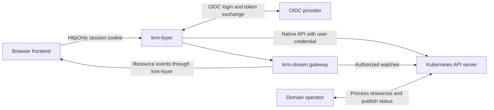

# Service design

krm-foyer is a backend for frontend (BFF) for browser applications built on Kubernetes
APIs. It owns OIDC login and server-side sessions, proxies an allowlisted set of
Kubernetes API routes with the user's own credential, and hosts krm-stream resource
streams on the frontend's origin.

This document is the contract: what krm-foyer must do. **None of it is implemented yet.**
Every guarantee below is a requirement until the test that tries to break it exists; the
[roadmap](roadmap.md) tracks which do. Why the service exists, and what it expects from
the domains behind it, is in the [vision](vision.md).

## Architecture and ownership

Deploy on the same origin as the frontend. An ingress or gateway routes krm-foyer's
prefixes (`/auth/`, `/k8s/`, `/stream`, `/_foyer/`) to it and everything else to the
frontend and any domain backend; krm-foyer does not host application files or forward
traffic outside its prefixes. Every service on that origin is inside the user's trust
boundary, since it can act as the signed-in user; see
[sharing one domain](ingress.md#decision-2026-10-01-sharing-one-domain-with-other-services).
The initial design uses one configured cluster per deployment and a configurable OIDC
provider. No particular identity provider or frontend framework is required.

krm-foyer terminates TLS itself from a mounted certificate, reloaded when it changes, or
sits behind an ingress that terminates TLS. Both are supported, but they are not equally
safe: behind an ingress, the hop to krm-foyer carries session cookies, and in plain HTTP
anything that can observe that hop can take a session. Plain HTTP is acceptable only
where nothing but the ingress can reach krm-foyer; otherwise the ingress re-encrypts and
verifies krm-foyer's certificate. See [both TLS models](ingress.md#decision-2026-10-01-both-tls-models).
Its public URL is configuration: the OIDC redirect URI, same-origin and CSRF checks and return
paths use it, never `Host` or `X-Forwarded-*`. An ingress in front must be transparent: no
buffering of streams, and no authentication or header rewriting of its own on krm-foyer's
routes. An ingress's external-authentication feature (`auth_request`, ForwardAuth) is used only as a
login gate for the application's pages, through `/auth/check`. It never decides on `/k8s` or
`/stream` traffic. The [ingress decision](ingress.md) explains why, and what would make
more worth revisiting.

krm-foyer has two halves. The **login half** (`/auth/...`) obtains the user's OIDC token
and keeps it in the server-side session. The **API half** (`/k8s`, `/stream`) takes the
user's token from one credential interface, applies the allowlist and sends the request
with that token, and the API server validates it. The API half's contract is the user's own
token, checked by Kubernetes. Login is a convenience behind that interface: it could
later accept tokens obtained elsewhere, or move into a separate program, without changing
the API half.

| Component or team | Responsibility |
| --- | --- |
| krm-foyer | OIDC client, sessions, CSRF protection, fixed upstream routing, API proxy and stream host configuration |
| [krm-stream](https://github.com/ConfigButler/krm-stream) | Resource-stream protocol, recovery, projections, optional watch sharing and browser draft/reconciliation primitives |
| Kubernetes | Discovery, persistence, RBAC, admission execution, API validation and write concurrency |
| Domain team | Resource contracts, admission rules, controller processing, trusted status and domain guarantees |
| Frontend team | Forms, resource queries, save intent, navigation and presentation of domain outcomes |
| Platform team | Deployment, grants, exposure configuration, availability and upgrades |

Application-specific endpoints, DTO transformations, result aggregation and business plugins
are outside krm-foyer's scope; the [vision](vision.md#staying-small) lists what stays out.
Domain services and operators own those responsibilities. Streaming and reconciliation
come from krm-stream, not from a reimplementation here.

## API contract

| Route | Behavior |
| --- | --- |
| `/auth/login` | Start OIDC authorization-code login with PKCE, state and nonce |
| `/auth/callback` | Validate the callback and establish a session |
| `/auth/session` | Return minimal identity/session state and CSRF information, never bearer tokens |
| `/auth/logout` | CSRF-protected POST that destroys the server session |
| `/auth/check` | 204 or 401 (or 302 to login on request) for an ingress gating the application's pages; never a token or identity. See the [login gate](ingress.md#decision-2026-10-01-a-login-gate-for-the-applications-pages) |
| `/k8s/api/...` | Proxy core Kubernetes APIs after stripping `/k8s` |
| `/k8s/apis/...` | Proxy grouped APIs, including CRDs and aggregated APIs |
| `/k8s/api`, `/k8s/apis`, `/k8s/version`, `/k8s/openapi/...` | Proxy explicitly permitted discovery/schema endpoints |
| `/stream` | Serve krm-stream with configured scopes and projections |
| `/auth/whoami` | Who Kubernetes takes the user to be, from a SelfSubjectReview, plus the session's issuer and expiry. Never tokens |
| `/_foyer/access` | What the user may do through krm-foyer: the allowlist and RBAC together. See [what may I do](#what-may-i-do) |

For example, POSTing to
`/k8s/apis/workspaces.example.com/v1/namespaces/team-a/workspacerequests` creates a
resource through Kubernetes (the [vision](vision.md#what-it-takes-from-the-domain) follows
that request through its lifecycle). The response retains Kubernetes' status code and object shape.
The route is available only when explicitly permitted by exposure policy and authorized
by Kubernetes.

Preserve bodies, Kubernetes `Status` errors, content types, relevant headers and query
parameters. Support pagination, selectors, native watches, CRUD, patch types, dry-run and
Server-Side Apply using their [native semantics](https://kubernetes.io/docs/reference/using-api/api-concepts/).
Clients choose concurrency preconditions and field ownership. The proxy must not force
apply, convert PATCH to PUT or automatically replay mutations after authentication recovery.
A lost response may already have committed a write.

The service has no hardcoded resource catalogue. Its initial transport scope covers ordinary
HTTP APIs, streaming logs and native HTTP watches. Exec, attach and port-forward require
separate upgrade-protocol support and tests; return an explicit unsupported error until
implemented. Service/node/pod proxy subresources require explicit opt-in. The browser
cannot supply an arbitrary upstream URL.

### Upstream responses

Stripping request headers covers what goes up. What comes back crosses the same
boundary, onto an origin the browser trusts, and needs rules of its own. They hold for
every route, and must hold before any aggregated API or proxy subresource is enabled,
since those return whatever their backend sends:

- **Content types are allowlisted.** JSON, YAML, Kubernetes protobuf and the watch
  stream types pass; `text/plain` passes for logs. Anything else, `text/html` above all,
  is held back unless the route opts in. A pod log or a proxied service must not be able
  to serve a page that runs as the user on the shared origin.
- **Every proxied response carries** `X-Content-Type-Options: nosniff`,
  `Content-Security-Policy: default-src 'none'; sandbox` and `Cache-Control: no-store`,
  replacing anything upstream sent. A shared cache in front of the origin must never
  hold one user's answer for another. `/auth/session` and `/auth/check` are `no-store`
  too.
- **Response headers are allowlisted** (content type and length, `Audit-Id`, `Warning`,
  `Retry-After` and the API priority-and-fairness headers). Everything else is dropped,
  including `Set-Cookie`, which would reach every service on the origin, and
  `Access-Control-*`: krm-foyer is same-origin only and never grants CORS.
- **Redirects are not followed and not passed on automatically.** A `Location` from an
  aggregated API could send the browser anywhere, so the user decides.

A held-back response is answered as an [interruption](#interruptions): code gets a
`Status` with status 502 and the reason, and a person browsing gets a page that
explains it. For a redirect, both carry the target; for HTML, the page shows its source
as escaped text. Every interruption is logged.

### Interruptions

krm-foyer is meant to be explorable in a browser, not only through a library. Opening
`/k8s/api/v1/namespaces/team-a/configmaps` in a tab shows the API server's JSON, exactly
as code would receive it. Wherever krm-foyer itself stands between the user and that
answer, it says so in a form the requester can read:

| Interruption | Status | For code | For a person browsing |
| --- | --- | --- | --- |
| No session | 401 | `Status`, reason `Unauthorized` | A page with a **Sign in** link that returns to this URL |
| Not on the allowlist | 403 | `Status` saying the route is not exposed | A page saying krm-foyer does not expose this route, as opposed to Kubernetes refusing it, with a link to [`/_foyer/access`](#what-may-i-do) |
| Upstream redirect | 502 | `Status` with the target in `details` | A notice naming the full target, with a link the user can follow |
| Upstream content held back | 502 | `Status` with the content type | A page showing the response as escaped text, truncated at a bound |
| Session store unavailable | 503 | `Status` | A page saying so, with no retry loop |

Rules:

- **The status code is the same in both forms.** Only the body differs. A client that
  checks the code sees one behavior.
- **A page is chosen only for a browser navigation:** a `GET` with `Sec-Fetch-Dest:
  document`. Browsers set that header, page scripts cannot, and non-browser clients do
  not send it, so `fetch`, the helper and `kubectl`-style clients always get JSON.
- **Answers from Kubernetes are never replaced.** A 403 from RBAC, a 404 or a 409 is the
  API server's answer and reaches the tab as its JSON. Interruptions are only what
  krm-foyer itself decided.
- **Permission is a link, never an action.** Following a redirect is a navigation the
  user starts; nothing is re-sent, and no request with a body is ever continued. An
  upstream HTML page is never rendered on the origin, with or without consent: consent
  to run unknown script as yourself is not consent anyone can meaningfully give.
- **The pages follow the [page rules](frontend.md#what-ships-in-the-binary):** no script,
  a strict Content-Security-Policy, `no-store`, and nothing about configuration beyond
  what the requester is allowed to see.

## Access boundaries

An operator-configured allowlist is mandatory from the first release. Empty configuration
exposes no Kubernetes APIs or stream scopes. Explicitly configure groups, versions,
resources, namespaces, verbs, subresources and permitted non-resource URLs. Distinguish
get/list/watch and collection deletion. Reject non-canonical paths (encoded slashes, dot
segments, repeated slashes) instead of normalizing them, forward exactly the path that was
checked, and reject unknown or ambiguous scopes. Discovery does not grant access.

Query parameters are part of policy evaluation. Recognize `watch=true` on a collection
path as watch access, not an ordinary list. Explicitly configure allowed label/field
selectors and enforce any required scope on every request, including requests with
`limit` and `continue`. Reject unsupported or ambiguous query combinations. Selectors
may narrow an authorized scope; user-controlled selectors cannot establish ownership.

Bound page sizes, response bytes, request rates, watch duration and concurrent streams.
Do not claim these bounds prevent export: a user allowed to list a namespace can normally
retrieve it through repeated pages. If full enumeration is unacceptable, narrow the
underlying readable resources or provide a restricted domain view.

Apply restrictions to raw APIs and streams. Kubernetes RBAC and admission remain authoritative;
the allowlist further limits which permissions browser clients can exercise through this service.
Never use a privileged service account as a fallback for a user's direct API request.

### What may I do

What a user can do through krm-foyer is what RBAC allows **and** the allowlist exposes.
A frontend can ask Kubernetes the first half itself, with a native
SelfSubjectAccessReview, but that answer is the larger set: it would offer actions on
routes krm-foyer never exposes. Only krm-foyer knows both halves, so it answers the
question:

- **`/_foyer/access?namespace=team-a`** lists every allowlisted resource with its
  verbs, and marks each cell **allowed**, **refused by Kubernetes** or **not exposed by
  krm-foyer**. Those are the two different 403s a frontend has to tell apart.
- **Each cell is one SelfSubjectAccessReview, sent with the user's own token,** so the
  answer comes from whatever authorizers the cluster runs and is audited as the user.
  Not SelfSubjectRulesReview: Kubernetes documents it as possibly incomplete, webhook
  authorizers often do not support it, and it lists rules for routes that are not exposed.
- **Namespaces** come from the allowlist when it names them, and from the `namespace`
  parameter when it allows a pattern. Object names are out of scope: a frontend that
  needs name-level answers makes the request and handles the 403.
- **The same URL serves people and code,** under the [interruption](#interruptions)
  rule: a navigation gets the page, `fetch` gets JSON with the same content.
- **It is a hint, with a timestamp.** Frontends use it to hide what will be refused, not
  to protect anything; every request is still decided when it is made. krm-foyer never
  uses it for its own decisions and caches nothing between requests.
- **Signed-in users only, about themselves.** It shows the allowlist to signed-in users,
  which their frontend's requests reveal anyway; anonymous visitors get the 401
  interruption. One page view costs one review per allowlisted resource and verb, run
  concurrently, capped and rate-limited per session.
- **It shows no objects and changes nothing.** A list of routes with their verbs, not a
  resource browser.

**Review exposure before enabling a route.** An existing application may enforce rules that
its users' Kubernetes grants do not express. A generic route can bypass those rules as soon
as it is available, even if the frontend still calls the old endpoint. Likewise, existing
list/watch grants may reveal records that an application previously returned only as aggregates.
Audit effective grants and deploy required admission/read boundaries before enabling access.

If a migration narrows raw reads, coordinate the replacement read path: an old result handler
using the user's token will also lose those permissions. Admission cannot filter ordinary
resource reads. If a product instead adopts asynchronous acceptance, explicitly redefine
what may be stored and what may be processed before exposing creates.

## Login and sessions

Tokens and session contents stay server-side. The browser holds only an opaque session ID
in a Secure, HttpOnly, host-scoped cookie with appropriate SameSite settings. Server-side
sessions support per-session revocation and refresh-token custody. They require shared
storage across replicas, bounded logout propagation and a defined failure policy.

**The session ID is a bearer credential.** Whoever holds it can call krm-foyer as the
user, from anywhere, until the session ends. `HttpOnly` keeps it from page scripts and
`Secure` from plain-HTTP requests; neither keeps it out of a log file, a co-hosted
service that sees the `Cookie` header, or an unencrypted proxy hop. So krm-foyer treats it
like a token: it never logs it or puts it in a URL or error page, and the session store
keys sessions by a hash of the ID, so reading the store does not yield usable IDs.

An encrypted HttpOnly cookie can also keep tokens unreadable by JavaScript; the reason
for choosing opaque sessions is revocation and lifecycle control. Clearing a browser cookie
alone does not invalidate a copied stateless session. The BFF pattern is described in [OAuth 2.0 for Browser-Based Applications](https://www.rfc-editor.org/rfc/rfc10017.html).

Use a maintained OIDC library. Bind login transactions to the browser; validate issuer,
audience and callback state; accept only validated local return paths. Rotate session IDs
at login, enforce idle/absolute expiry and serialize supported refreshes per session. Reject
requests when session validity cannot be established. The configured issuer must provide a
credential accepted by the cluster; an arbitrary OIDC login or access token is insufficient.

Unauthenticated API requests return a documented 401 login-required response, not an HTML
redirect; a person browsing gets the same 401 with a sign-in link (see
[interruptions](#interruptions)). An optional framework-independent helper handles login navigation and return paths.
Expose authentication-required state before navigation so an editor can offer draft copy-out
or an explicitly designed preservation flow. A 403 represents permission denial, not a login
loop. Bound refresh attempts and report persistent issuer/cluster configuration errors.

Require CSRF proof and same-origin checks for mutations and logout. Strip browser-supplied
Authorization, impersonation and untrusted forwarding headers; never forward the session
cookie to Kubernetes. Pin upstream destinations, verify TLS, bound request/stream resources
and avoid credential/body logging. HttpOnly does not prevent malicious same-origin JavaScript
from making requests as the user.

### Session lifecycle

Revocation is as fast as its slowest path. Each row is a requirement with a test:

| Event | Required behavior |
| --- | --- |
| Logout | The session is deleted from shared storage before the logout response is sent. No replica caches a session's validity, so every replica refuses the ID on its next request |
| Logout during a refresh | Logout wins. The refreshed tokens are discarded, never written back into a deleted session |
| Session store unavailable | Fail closed: API and stream requests get 503. Never a stale local copy, never anonymous, never the service account |
| Streams open at logout | Closed on every replica within the session-check interval, a configured bound with a documented default |
| Token expiry or failed refresh | API requests get 401; streams close at the token's expiry or the session's, whichever comes first |
| RBAC change | Kubernetes applies it on the next request. A shared watch applies it within its SubjectAccessReview recheck interval; that is reauthorization, not revocation |
| User disabled at the issuer | krm-foyer learns of it at the next refresh. Until then the API server accepts the ID token it already holds, so the bound is the token lifetime the issuer sets. Document it; do not claim faster |

Revoking a session does not revoke tokens the issuer handed to other clients, and does
not undo writes Kubernetes already accepted.

## Streams and editing

krm-foyer supplies krm-stream's principal resolution, authorization, backend selection and
scope configuration. Start with user-authenticated watches. Optional shared watches use a
narrowly scoped service account, Kubernetes-resolved identities and per-subscriber
SubjectAccessReview checks. Bound reauthorization and session expiry; logout closes that
session's streams without disrupting others. Measure authorization load as well as watch
savings. Disable stream buffering and propagate cancellation through the proxy.

A stream projection is a view transformation. It cannot protect confidential fields if the
same user can GET the full resource through `/k8s`. Restrict raw routes or separate the
read models when disclosure differs; Kubernetes RBAC does not provide general field-level
permissions.

Keep draft capture and guarded reconciliation in the frontend. A raw GET used to reconcile
a projected editor must follow the same view contract and guards against late responses or
changed UID. Never manufacture redaction revisions from a raw GET. Verify the library APIs
support the chosen composition.

Use conditional PATCH with UID/resourceVersion checks where required. Do not replace a full
resource with its projected view or assume arrays merge safely. A write response must not
overwrite newer watch state or later typing: consume it as a receipt or through guarded
reconciliation. A restricted projected-write policy needs its own validation; transparent
proxying does not supply that policy. Multi-step domain workflows retain explicit handling
of partial success.

## Release criteria

| Capability | Required evidence |
| --- | --- |
| Reuse | Two frontends using different API groups without application-specific backend handlers |
| Authentication | Callback failure, expiry, refresh, restart and logout tests across replicas |
| Session lifecycle | Every bound in [session lifecycle](#session-lifecycle) measured by a test, including logout racing refresh, store outage and streams open at logout |
| Credential custody | No token krm-foyer holds, including refreshed ones, and no session ID in any response, log line or error page the suite collects |
| Exposure | Empty policy denies access; paths, selectors, watch queries, pagination, alternate versions and subresources cannot bypass restrictions |
| Proxy semantics | Kubernetes errors and patch types preserved; conflicting writes and ambiguous create outcomes handled without automatic replay |
| Upstream responses | An upstream that sends HTML, `Set-Cookie`, CORS headers, cache headers or a redirect has none of them reach the browser unasked |
| Interruptions | Each interruption gives the same status to code and to a navigation; scripts cannot obtain the page form; no Kubernetes answer is ever replaced |
| What may I do | `/_foyer/access` matches what requests through krm-foyer actually get, cell for cell, for allowed, refused and unexposed routes, and follows a RoleBinding change without a new login |
| Streams | Cancellation, recovery, expiry, subscriber isolation and measured load under declared capacity targets |
| Editing | Conditional saves and guarded reconciliation preserve newer state and drafts |
| Example domain | Pending, accepted, rejected and failed processing demonstrated; protected status and restart/duplicate tests prove its declared guarantees |
| Operations | Owned session storage, deployment/upgrade procedures, telemetry and tested failure behavior |

The domain operator's tests establish domain guarantees; the gateway's tests establish
transport and access behavior. Publish the service with its own integration fixture,
versioned image and documented supported protocols.

## Related decisions

- [Ingress and TLS](ingress.md): both TLS models, sharing one domain, the login gate,
  and why an ingress never makes the access decision.
- [Pages](frontend.md): which pages krm-foyer serves itself.
- [Testing](testing.md): how the suite proves krm-foyer invents neither authentication
  nor authorization.
- [Name](name.md): why it is called krm-foyer.
