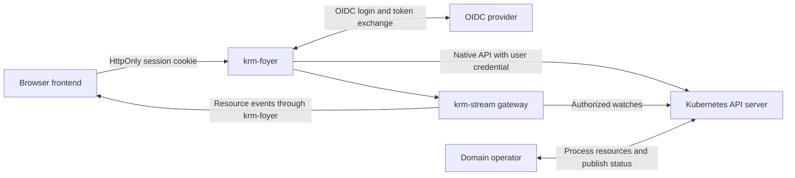

# Service design

krm-foyer is a backend for frontend (BFF) for browser applications built on Kubernetes
APIs. It owns OIDC login and sessions sealed into the browser's cookie, proxies Kubernetes API requests with
the user's own credential, and hosts krm-stream resource
streams on the frontend's origin.

This document is the contract: what krm-foyer must do. Login, single-replica sessions,
the API proxy, bounds, streams and opt-in shared watches have implementation and tests.
Planned routes and lifecycle requirements are marked below; the [roadmap](roadmap.md)
tracks the evidence still missing. A requirement is not a delivered guarantee until
its test exists and passes. The [vision](vision.md) explains why the service exists.

## Architecture and ownership



Deploy on the same origin as the frontend. An ingress or gateway routes krm-foyer's
prefixes (`/auth/`, `/k8s/`, `/stream`, `/_foyer/`) to it and everything else to the
frontend and any domain backend; krm-foyer does not host application files or forward
traffic outside its prefixes. Every service on that origin is inside the user's trust
boundary, since it can act as the signed-in user; see
[sharing one domain](ingress.md#decision-2026-10-01-sharing-one-domain-with-other-services).
The initial design uses one configured cluster per deployment and a configurable OIDC
provider. No particular identity provider or frontend framework is required.

krm-foyer terminates TLS itself from a mounted certificate, or
sits behind an ingress that terminates TLS. Certificates are currently read at startup;
reload on rotation is a planned requirement. Both network models are supported, but
they are not equally safe: behind an ingress, the hop to krm-foyer carries session
cookies, and in plain HTTP anything that can observe that hop can take a session. Plain HTTP is acceptable only
where nothing but the ingress can reach krm-foyer; otherwise the ingress re-encrypts and
verifies krm-foyer's certificate. See [both TLS models](ingress.md#decision-2026-10-01-both-tls-models).
Its public URL is configuration: the OIDC redirect URI, same-origin and CSRF checks and return
paths use it, never `Host` or `X-Forwarded-*`. An ingress in front must be transparent: no
buffering of streams, and no authentication or header rewriting of its own on krm-foyer's
routes. The planned `/auth/check` lets an ingress's external-authentication feature
(`auth_request`, ForwardAuth) act only as a login gate for the application's pages.
Until it exists, the helper's `requireSession()` handles that navigation. A login gate
never decides on `/k8s` or `/stream` traffic. The [ingress decision](ingress.md) explains why, and what would make
more worth revisiting.

krm-foyer has two halves. The **login half** (`/auth/...`) obtains the user's OIDC token
and seals it into the session cookie, which only krm-foyer can open. The **API half** (`/k8s`, `/stream`) takes the
user's token from one credential interface and sends the request with that token, and
the API server validates it and decides. The API half's contract is the user's own
token, checked by Kubernetes. Login is a convenience behind that interface: it could
later accept tokens obtained elsewhere, or move into a separate program, without changing
the API half.

The code keeps that split. `internal/session` keeps sessions and states its refusals in
its own terms (no session, not from this origin, no CSRF proof), with no HTTP answers.
`internal/auth` serves the login routes and is the credential interface: it is the one
place a session error becomes an answer. `internal/gate` asks that interface for a token
or an answer, holds every request to the [bounds](bounds.md), and cuts an open response
short when its session ends; `/k8s` and `/stream` share it. `internal/proxy` takes a
request the gate let through, with its token, and knows nothing of sessions.
`internal/interruption` writes what
krm-foyer answers instead of the API server, as a `Status` or a page. `cmd/krm-foyer`
reads the configuration, one section per package, and wires them together.

| Component or team | Responsibility |
| --- | --- |
| krm-foyer | OIDC client, sessions, CSRF protection, fixed upstream routing, API proxy and stream host configuration |
| [krm-stream](https://github.com/ConfigButler/krm-stream) | Resource-stream protocol and reference Go gateway, recovery, projections and change suppression, optional watch sharing and browser draft/reconciliation primitives |
| Kubernetes | Discovery, persistence, RBAC, admission execution, API validation and write concurrency |
| Domain team | Resource contracts, admission rules, controller processing, trusted status and domain guarantees |
| Frontend team | Forms, resource queries, save intent, navigation and presentation of domain outcomes |
| Platform team | Deployment, grants that match each application, availability and upgrades |

Application-specific endpoints, DTO transformations, result aggregation and business plugins
are outside krm-foyer's scope; the [vision](vision.md#staying-small) lists what stays out.
Domain services and operators own those responsibilities. Streaming and reconciliation
come from krm-stream, not from a reimplementation here.

## API contract

| Route | Behavior |
| --- | --- |
| `/auth/login` | Start OIDC authorization-code login with PKCE, state and nonce; `return_to` names a local path to come back to, and `oidc.<name>` gives a configured [login parameter](#login-parameters) for the issuer |
| `/auth/callback` | Validate the callback and establish a session, then `303` to the return path |
| `/auth/session` | Return minimal identity/session state and CSRF information, never bearer tokens: `200` with `authenticated`, `issuer`, `subject`, `email`, `displayName`, `groups`, `connector` when configured, `expiresAt`, `csrfToken` and `csrfHeader`, or `401` with `{"authenticated":false}`. See [session claims](#session-claims) |
| `/auth/logout` | CSRF-protected POST that clears the session cookie, ends the session's open responses in this process and answers `204`; it revokes no copy of the cookie ([sessions](#sessions)). The caller then goes where it likes, `/auth/logged-out` by default |
| `/auth/check` **(planned)** | 204 or 401 (or 302 to login on request) for an ingress gating the application's pages; never a token or identity. See the [login gate](ingress.md#decision-2026-10-01-a-login-gate-for-the-applications-pages) |
| `/k8s/api/...` | Proxy core Kubernetes APIs after stripping `/k8s` |
| `/k8s/apis/...` | Proxy grouped APIs, including CRDs and aggregated APIs |
| `/k8s/api`, `/k8s/apis`, `/k8s/version`, `/k8s/openapi/...` | Proxy discovery and schema endpoints |
| `/stream/v1` | A [krm-stream](https://github.com/ConfigButler/krm-stream/blob/main/spec/v1.md) resource stream (`GET`, the scope in the query): a watch opened as the user, or an opt-in shared watch guarded by API-server reviews. See [streams and editing](#streams-and-editing) |
| `/auth/whoami` | Who Kubernetes takes the user to be: a fresh SelfSubjectReview with the user's own token, answered as `200` with the API server's `userInfo` (username, UID, groups, extra), the session's `issuer` and `expiresAt`, `no-store`. Never tokens. See [whoami](#whoami) |
| `/_foyer/access` **(planned)** | A page showing what the user may do, from Kubernetes' own reviews. See [what may I do](#what-may-i-do) |

Planned routes currently return 404. The start page (`/`), logout confirmation
(`/auth/logged-out`), probes (`/healthz`, `/readyz`) and static assets under `/_foyer/`
also exist. `/readyz` records successful initial issuer discovery; it is not a live
check of the issuer, API server or shared-watch permissions.

Metrics are served on a listener of their own (`-metrics-listen`), never on the origin;
see [metrics](bounds.md#metrics).

For example, POSTing to
`/k8s/apis/workspaces.example.com/v1/namespaces/team-a/workspacerequests` creates a
resource through Kubernetes (the [vision](vision.md#what-it-takes-from-the-domain) follows
that request through its lifecycle). The response retains Kubernetes' status code and object shape.
Whether it succeeds is Kubernetes' decision alone.

Preserve bodies, Kubernetes `Status` errors, content types, relevant headers and query
parameters. Support pagination, selectors, native watches, CRUD, patch types, dry-run and
Server-Side Apply using their [native semantics](https://kubernetes.io/docs/reference/using-api/api-concepts/).
Clients choose concurrency preconditions and field ownership. The proxy must not force
apply, convert PATCH to PUT or automatically replay mutations after authentication recovery.
A lost response may already have committed a write.

The service has no hardcoded resource catalogue. Its initial transport scope covers ordinary
HTTP APIs, streaming logs and native HTTP watches. Exec, attach and port-forward require
separate upgrade-protocol support and tests; return an explicit unsupported error until
implemented. Any request asking to upgrade the connection (and any `CONNECT`) gets the
same error, whatever its path. The browser cannot supply an arbitrary upstream URL, and
under `/k8s` only the routes in the table above exist: the API server's other endpoints
(`/healthz`, `/metrics`, `/logs`, `/openid/...`) are not routes of krm-foyer.

**Service, node and pod proxy subresources are deferred** and get the same explicit
unsupported error. RBAC would still decide who may use them, but what sits behind them
is an arbitrary application, and an arbitrary application may change state on a `GET`.
krm-foyer cannot tell from the method, and a cross-site page can make a signed-in
browser send a `GET` by navigating to it; holding back the HTML that comes back happens
after the backend has acted. So when they are supported, **every request through a proxy
subresource, whatever its method, needs CSRF proof** and is refused without it, which
also means they cannot be opened by typing a URL into a tab. The
[upstream response](#upstream-responses) rules apply on top. Kubernetes' own `GET`s are
safe by API convention, so the rest of `/k8s` stays navigable.

### Upstream responses

Stripping request headers covers what goes up. What comes back crosses the same
boundary, onto an origin the browser trusts, and needs rules of its own. They hold for
every route, and matter most for aggregated APIs and, once supported, proxy
subresources, which return whatever their backend sends:

- **Content types are allowlisted.** JSON, YAML, Kubernetes protobuf and the watch
  stream types pass; `text/plain` passes for logs. Anything else, `text/html` above all,
  is held back, and so is a body with no content type. A pod log or a proxied service
  must not be able to serve a page that runs as the user on the shared origin. A
  `Content-Type` sent as more than one header field, or containing a comma, is held back
  too: a browser may pick a different value from the one checked. A `HEAD` response has
  no body, so it needs no content type.
- **Every proxied response carries** `X-Content-Type-Options: nosniff`,
  `Content-Security-Policy: default-src 'none'; sandbox` and `Cache-Control: no-store`,
  replacing anything upstream sent. A shared cache in front of the origin must never
  hold one user's answer for another. `/auth/session` and `/auth/check` are `no-store`
  too.
- **Response headers are allowlisted** (content type and length, `Audit-Id`, `Warning`,
  `Retry-After` and the API priority-and-fairness headers). Everything else is dropped,
  including `Set-Cookie`, which would reach every service on the origin, and
  `Access-Control-*`: krm-foyer is same-origin only and never grants CORS. Headers that
  arrive outside the checked response, in an informational (1xx) response or as
  trailers, are dropped with it.
- **Bodies reach the browser decoded.** Dropping `Content-Encoding` while passing a
  gzip body on would hand the browser bytes it cannot read. krm-foyer drops the
  browser's `Accept-Encoding`, so Go's transport asks the API server for gzip and
  decodes it transparently (it does not when the request already names an encoding),
  and the browser receives the body uncompressed with no `Content-Encoding`. The bound
  on response bytes counts decoded bytes, so a small compressed body cannot expand past
  it. A response that still carries a `Content-Encoding` field, even an empty one, is
  held back. Compressing
  towards the browser is a later performance choice, not part of the boundary.
- **Redirects are not followed and not passed on automatically.** A `Location` from an
  aggregated API could send the browser anywhere, so the user decides.

A held-back response is answered as an [interruption](#interruptions): code gets a
`Status` with status 502 and the reason, and a person browsing gets a page that
explains it. For a redirect, both carry the target. For held-back HTML, the page names
the content type; a bounded, escaped source preview is planned. Every interruption is
logged ([how](#interruptions)).

### Interruptions

krm-foyer is meant to be explorable in a browser, not only through a library. Opening
`/k8s/api/v1/namespaces/team-a/configmaps` in a tab shows the API server's JSON, exactly
as code would receive it. Wherever krm-foyer itself stands between the user and that
answer, it says so in a form the requester can read:

| Interruption | Status | For code | For a person browsing | Reached Kubernetes |
| --- | --- | --- | --- | --- |
| No session | 401 | `Status`, reason `Unauthorized` | A page with a **Sign in** link that returns to this URL | No |
| Upstream redirect | 502 | `Status` with the target in `details` | A notice naming the full target, with a link the user can follow when it is an absolute `http` or `https` URL; any other target is shown as text only | Yes |
| Upstream content held back | 502 | `Status` with the content type | A page naming the content type. Later: the response as escaped text, truncated at a bound | Yes |
| Session cannot be checked | 503 | `Status` | A page saying so, with no retry loop | No |
| Non-canonical path | 400 | `Status` naming the [path rule](#access) | A page saying so | No |
| Path under `/k8s` that is not an [API route](#api-contract) | 404 | `Status`, reason `NotFound` | A page saying so | No |
| Missing CSRF proof or cross-origin request | 403 | `Status` with reason `CSRFProofRequired` or `CrossOriginRequest`, never RBAC's `Forbidden` | A page saying so | No |
| Unsupported protocol or subresource | 501 | `Status` naming what is unsupported | A page saying so | No |
| A `/stream/v1` request that is not a `GET` | 405 | `Status`, reason `MethodNotAllowed` | The same `Status`: only a `GET` is answered with a page | No |
| A [bound](bounds.md) reached | 429 for the request rate, for concurrent requests and for streams open; 502 for a response known to exceed its size bound before it starts | `Status` naming the bound, with `Retry-After` for the request rate | A page saying so | No for a 429; yes for a 502 |
| API server unreachable | 502 | `Status` | A page saying so | Perhaps: a connection can fail after the request was sent |

This table lists interruptions from the API gate and proxy. Once `/stream/v1` starts,
its protocol uses the [stream errors](#streams-and-editing) below. Login routes have
their own [failure responses](#login).

Rules:

- **A response under way is never replaced.** When a bound, or the end of the session,
  cuts short a response that has already started, the response is aborted and the
  request to the API server cancelled. An aborted response cannot pass for a complete
  one. See [cutting a response short](bounds.md#cutting-a-response-short).
- **The status code is the same in both forms.** Only the body differs. A client that
  checks the code sees one behavior.
- **Every interruption names its reason in a `Krm-Foyer-Interruption` header**, in both
  forms. The proxy passes no upstream header outside its allowlist, so the API server,
  or an aggregated API, cannot send it. A body is no such proof: any API can answer a
  `Status` with reason `CSRFProofRequired`. The header says krm-foyer answered, not that
  Kubernetes never saw the request: the last column says which reasons guarantee that.
  The helper resends a change only on `CSRFProofRequired` with this header, because
  then the change did not reach Kubernetes.
- **A page is chosen only for a browser navigation:** a `GET` with exactly one
  `Sec-Fetch-Dest: document` field. Browsers set that header, page scripts cannot, and
  non-browser clients do not send it, so `fetch`, the helper and `kubectl`-style clients
  always get JSON. An iframe (`Sec-Fetch-Dest: iframe`), any other method, a repeated
  field or `Accept: text/html` alone gets JSON too.
- **Answers from Kubernetes are never replaced.** A 403 from RBAC, a 404 or a 409 is the
  API server's answer and reaches the tab as its JSON. Interruptions are only what
  krm-foyer itself decided. For a 403, [`/_foyer/access`](#what-may-i-do) is where a
  person will be able to investigate the refusal once that page exists.
- **Every refusal is one log line**, whoever refused: `"msg":"refused"`, with `by`
  (`krm-foyer` or `kubernetes`), the `user` as the issuer named them once the request
  has a session, the `route`, method and path (never the query), and the reason. That is
  an interruption below 500; the API server's 401, 403, 409 or 422 on `/k8s`; and a
  stream's `FORBIDDEN`, `UNAUTHENTICATED` or `SCOPE_INVALID`, with the scope asked for.
  An interruption from 500 is a failure, not a refusal, and is logged as
  `"msg":"interruption"`. What the API server wrote is never logged.
- **Permission is a link, never an action.** Following a redirect is a navigation the
  user starts; nothing is re-sent, and no request with a body is ever continued. An
  upstream HTML page is never rendered on the origin, with or without consent: consent
  to run unknown script as yourself is not consent anyone can meaningfully give.
- **The pages follow the [page rules](frontend.md#what-ships-in-the-binary):** no script,
  a strict Content-Security-Policy, `no-store`, and nothing about configuration beyond
  what the requester is allowed to see.

## Access

**Kubernetes alone decides what a request may do.** krm-foyer adds no access rules of
its own: whatever the user's RBAC allows is reachable through `/k8s` and `/stream`, and
whatever it refuses is refused by the API server, with the API server's answer. There is
no allowlist, so there is nothing to configure and no second set of rules to keep in step
with RBAC.

The consequence has to be said plainly: **a session on krm-foyer carries the user's full
Kubernetes access.** Any script running on the application's origin can use all of it.
Deploy krm-foyer for users whose grants match what the application needs, and keep the
origin to services you trust with that access. Limiting what an application may do
beyond RBAC is a separate, deferred design: [application scope](application-scope.md).

What krm-foyer still does on every request, none of it an access decision:

- **Path hygiene.** Non-canonical paths are rejected rather than normalized: encoded
  slashes, dot segments, empty segments (repeated or trailing slashes), percent-encoding
  of characters that need none (letters, digits, `-`, `.`, `_`, `~`), lower-case or
  malformed percent-encoding, and raw characters RFC 3986 does not allow in a path
  segment. The path forwarded is byte-for-byte the path received, minus the `/k8s`
  prefix. Real Kubernetes clients never send such paths, and a scope layer added later
  can rely on there being one parse.
- **Request headers are allowlisted.** `Accept`, `Content-Type` and `User-Agent` go to
  the API server, with the user's token as the only `Authorization`. Everything else the
  browser sends is dropped: its own `Authorization`, `Impersonate-*`, `Cookie`,
  forwarding headers and `Accept-Encoding` among them.
- **[Bounds](bounds.md)** on the request rate per session, concurrent requests per
  session and per replica, response duration and response bytes, each configurable with
  a documented default. Native watches are requests like any other: krm-foyer does not
  tell them apart, and the bounds do not need it to. They protect krm-foyer and the API server from a runaway page.
  They are not access rules and do not prevent export: a user allowed to list a
  namespace can retrieve all of it through repeated pages. Nor do they hold back a
  determined user, who can open another session; the API server's Priority and Fairness
  limits each user. There is no bound on page size, because it would not bound anything
  ([why](bounds.md#left-out-a-bound-on-page-size)).
- **Never a privileged service account** as a fallback for a user's request. The one
  identity of krm-foyer's own is the optional [shared-watch identity](#shared-watches):
  given explicitly, used for shared watches and the reviews that guard them alone, and
  never the pod's service account unless pointed at it.

### What may I do

Kubernetes already answers this question, and code should ask it there: a
SelfSubjectAccessReview through `/k8s` says whether the user may do one thing, and a
SelfSubjectRulesReview lists what they may do in a namespace. Without a scope layer,
those native answers are exactly what requests through krm-foyer will get.

For a person with a browser tab, the planned `/_foyer/access` page will provide:

- **The rules for a namespace,** from a SelfSubjectRulesReview sent with the user's own
  token, as a table of resources and verbs. When Kubernetes marks the answer incomplete,
  which it does for authorizers that cannot list rules, the page says so in plain words.
- **A "can I?" form** (verb, resource, namespace, optionally a name) answered by a
  SelfSubjectAccessReview, which is authoritative for every authorizer. The form is a
  `GET`; asking changes nothing.
- **A page only.** Code uses the native reviews above; a second JSON shape for the same
  answer would only be something to keep in step.
- **Signed-in users only, about themselves.** Anonymous visitors get the 401
  [interruption](#interruptions). Reviews are audited as the user, and rate-limited per
  session.
- **It shows no objects and changes nothing.** Rules and answers, not a resource browser.

**Review grants before deploying.** An existing application may enforce rules that its
users' Kubernetes grants do not express. Once krm-foyer serves those users, every grant
they hold is reachable from the browser, even if the frontend still calls the old endpoint. Likewise, existing
list/watch grants may reveal records that an application previously returned only as aggregates.
Audit effective grants and deploy required admission/read boundaries before enabling access.

If a migration narrows raw reads, coordinate the replacement read path: an old result handler
using the user's token will also lose those permissions. Admission cannot filter ordinary
resource reads. If a product instead adopts asynchronous acceptance, explicitly redefine
what may be stored and what may be processed before exposing creates.

## Login and sessions

Sessions live in the browser: the session, the user's ID token included, is sealed
(AES-256-GCM) into a Secure, HttpOnly, host-scoped cookie with keys only krm-foyer
holds. Page scripts cannot read it and the browser cannot open or change it, so the
token still never reaches the page in a form it can use; krm-foyer stores nothing per
session, and a session survives a restart, or a replacement of the pod, with the same
keys. The price is revocation: krm-foyer keeps no list of sessions, so logout clears
the browser's cookie and ends what is open in the process, and a copy of the cookie is
a session until it expires. The [audience release plan](investigations/audience-release-plan.md)
records that choice. Refresh is planned, with its own lifecycle requirements below.

**The session cookie is a bearer credential.** Whoever holds it can call krm-foyer as the
user, from anywhere, until the session expires, logout or not. `HttpOnly` keeps it from
page scripts and `Secure` from plain-HTTP requests; neither keeps it out of a log file, a
co-hosted service that sees the `Cookie` header, or an unencrypted proxy hop. So
krm-foyer treats it like a token: it never logs it or puts it in a URL or error page.
**The session keys are worth every session.** Whoever reads them can open every cookie,
and with it read the user's token, and seal sessions of their own. They come from a
Secret the deployment creates and the chart only mounts.

### Login

- **The flow** is the authorization code flow with PKCE (`S256`), `state` and `nonce`,
  through `coreos/go-oidc` and `golang.org/x/oauth2`. The scopes default to
  `openid email profile`; `openid` is required, and `offline_access` is refused, because
  krm-foyer holds no refresh token until it can refresh. The redirect URI is the
  configured public URL plus `/auth/callback`.
- **A login in progress** is kept in the browser that started it: state, nonce, PKCE
  verifier, return path and expiry, sealed (AES-GCM) with a key that lives only in the
  process, in a cookie of its own named after a hash of its state,
  `__Host-krm-foyer-login-<hash>` (Secure, HttpOnly, Lax, ten minutes). The browser can
  neither read nor change it, and krm-foyer holds nothing per login, so anyone starting
  logins crowds out no one else's. The callback's `state` names the cookie: it must carry
  exactly one of that name, sealed for that name and unexpired, and the `state` it seals,
  before anything else the callback says, an issuer's `error` included, is acted on. The
  callback clears that cookie whether it succeeds or not, so a callback of another browser
  or a guessed state finds nothing, and other logins in progress in the same browser, as
  two tabs start after a restart, each finish their own. A callback replayed with its
  cookie put back, which takes the browser itself, carries a code the issuer has already
  redeemed and refuses: authorization codes are single use. A browser keeps at most three
  logins in progress; starting a fourth ends the oldest. A restart ends every login in
  progress: its key is the process's own, and a callback after one is refused as
  `login-not-in-progress`, so the user starts again. Established sessions survive it.
- **The ID token** must come from the configured issuer, for krm-foyer's client ID,
  unexpired, signed by a key the issuer publishes and carrying this login's nonce. Its
  `email` is shown; the API server decides who it belongs to.
- **The return path** must be a local path: it starts with one `/` and not two, and
  holds only printable ASCII other than `\`, at most 2,048 bytes. Anything else, or
  `return_to` given twice, is refused before the issuer is involved. After login the
  browser goes to exactly that path, uncleaned.
- **A refused login** gets the [callback error page](frontend.md#what-ships-in-the-binary)
  with a stable reason (`login-not-in-progress`, `state-mismatch`, `nonce-mismatch`,
  `id-token-invalid`, ...) and a link to try again. An error code from the issuer is
  shown only if it is one OAuth or OIDC defines; nothing else the callback says is
  repeated on the origin. A refused token exchange is logged the same way: the issuer's
  HTTP status and an error code OAuth defines, never its description, URI or body, since
  an issuer may echo the request, client secret and code included. A refused ID token is
  logged by cause (`expired`, `audience-mismatch`, `issuer-mismatch`, `not-yet-valid`,
  `signature`, `keys-unavailable` or `invalid`), never the verifier's error, which quotes
  the token's claims and the issuer's key-set response.
- **Until the issuer's discovery document has been read,** `/auth/login` answers 503 and
  `/readyz` fails; `/healthz` does not. krm-foyer keeps trying in the background.

### Login parameters

An application chooses login options in its own links and QR codes; the deployment
decides which options exist. `-login-config-file` (chart: `login`) names extra query
parameters for the issuer's authorization endpoint, by the issuer's own names:

```yaml
authorizationParameters:
  connector_id: {default: audience, allowFromRequest: true, allowedValues: [audience, operator]}
  login_hint: {allowFromRequest: true}
sessionClaims:
  connector: /federated_claims/connector_id
```

A link gives a value as `oidc.<name>`:
`/auth/login?return_to=%2F&oidc.connector_id=audience&oidc.login_hint=opaque-value`.
krm-foyer recognizes no product and interprets no value; the names above are Dex's.

- **Only what is configured is sent.** A parameter's default is sent when the link gives
  none, and a value the link gives replaces it when `allowFromRequest` allows. With
  `allowedValues`, only those values are sent, the default among them. A link carries
  values, never permission: a QR generator's own list is a convenience, not a check.
- **Anything else is refused before a login starts**, with a 400 `login-parameter-refused`
  and nothing sent to the issuer: an unknown `oidc.*` name, a value for a
  configuration-only parameter, a value not on the list, a repeated or empty value, a
  value over 512 bytes, more than 1,024 bytes of names and values in all, or a query Go
  would only read in part. The error page never repeats the value, and no value is
  logged.
- **krm-foyer's own parameters cannot be configured**, so no link can reach them:
  `client_id`, `redirect_uri`, `response_type`, `response_mode`, `scope`, `state`, `nonce`,
  `code_challenge` and `code_challenge_method`; `request` and `request_uri`, which would
  replace the request; and the credentials `client_secret`, `client_assertion` and
  `client_assertion_type`. Such a configuration stops krm-foyer at start. Scopes stay
  `-oidc-scopes`, trusted configuration; the endpoint stays the discovered one.
- **A value is query data, encoded once,** never trimmed, folded or otherwise changed.
  `return_to` is krm-foyer's and never goes to the issuer.
- **A failed login offers the same choice again** for the transaction's lifetime: its
  retry link repeats the values of parameters with `allowedValues`, such as a connector,
  and never a free value such as a hint, which is opaque and may be anyone's. After
  that, the application gives a fresh link.

Whether a hint or a room code is valid, and which connector makes someone a voter, is
for the issuer and its integration to decide; krm-foyer has no tests of their meaning.
An issuer that needs state of its own across its redirects, such as a handoff cookie,
keeps it in that integration.

### Session claims

`/auth/session` shows who the issuer says the user is, from the verified ID token only:
`displayName` (a string, at the JSON Pointer `sessionClaims.displayName`, `/name` by
default), `groups` (a list of strings, `/groups` by default) and, when
`sessionClaims.connector` is set, `connector` (a string). A claim that is missing, or
null, is empty: `displayName` is `""` and `groups` is `[]`, always present, and
`connector` is left out. A claim of another type fails the login with
`session-claims-invalid` (502). The shape is fixed: never a bag of whatever the token
carries.

The connector a link asked for is a request; the one `/auth/session` shows is the
token's claim, and the first never becomes the second. These are for the application
to show. Kubernetes decides access, by its own mapping of the token, which
[`/auth/whoami`](#whoami) shows.

### Whoami

`GET /auth/whoami` creates a SelfSubjectReview with the session's own token, through
the gate, so the per-session bounds hold, to the configured API server over verified
TLS, bounded at 10 seconds, refusing redirects. It answers the API server's `userInfo`
as it gave it, with the session's `issuer` and `expiresAt`. Its groups are the API
server's mapping, apart from the issuer's groups `/auth/session` shows. A missing,
invalid or expired cookie gets the 401 [interruption](#interruptions). A refusal from the
API server is passed on with its status and `Status`. A failure, or an answer naming no
user, is a 503: krm-foyer never infers a username from a claim and has no other
credential to try. It shares one implementation with the reviews of
[shared watches](#shared-watches).

### Attribution

[gitops-reverser](https://github.com/ConfigButler/gitops-reverser) names a commit's
author from two fixed keys of the Kubernetes user's `extra`, in audit events and
admission requests:

| Key | Signed claim | Use |
| --- | --- | --- |
| `configbutler.ai/claims/display-name` | `name` | Git author name |
| `configbutler.ai/claims/email` | `email` | Git author email |

They are UserInfo extras, not HTTP headers. krm-foyer already sends the user's signed
ID token, which carries both claims; the cluster operator adds the mapping to the JWT
authenticator's `claimMappings` in the API server's
[structured authentication configuration](https://kubernetes.io/docs/reference/access-authn-authz/authentication/#using-authentication-configuration):

```yaml
extra:
  - key: configbutler.ai/claims/display-name
    valueExpression: "claims.?name.orValue('')"
  - key: configbutler.ai/claims/email
    valueExpression: "claims.?email.orValue('')"
```

That is a fragment to merge into the authenticator, not a replacement of its issuer,
audiences, username, groups or validation rules; keep its email verification policy.
A missing claim maps to an empty value, which leaves the key out. krm-foyer sets no
`Impersonate-Extra-*` or `X-Remote-*` header, and strips any a browser sends:
impersonation or front-proxy authentication would change who establishes identity.
Nothing a link, a query or a header says reaches the author. `/auth/whoami` shows the
mapped extras; the e2e suite also checks them in the audit event of an accepted write
and in the admission request a validating admission policy received.

### Sessions

- **The cookie** is `__Host-krm-foyer-session`: `Secure`, `HttpOnly`, `Path=/`, no
  `Domain` (the `__Host-` prefix makes browsers insist on all three, so no other host can
  set it) and `SameSite=Lax`. Lax rather than Strict, because the browser arrives back from
  the issuer by a cross-site navigation, and a link to a `/k8s` URL should open signed in;
  every request that changes state needs CSRF proof regardless.
- **Its value** is unpadded base64url, with exactly one spelling, of a format version, the
  ID of the key that sealed it, a random nonce, and the session encrypted and
  authenticated with AES-256-GCM: issuer, subject and email, the ID token, a random
  session ID, the CSRF token, and when it was issued and when it ends. The version, the
  key's ID and the cookie's name are authenticated with it, so a cookie of another
  version, key or purpose is no session. Anything that does not open, holds anything
  but a whole session, or has more than one cookie of that name, is no session, and
  never reaches the API server: choosing between two cookies would be a guess.
- **The keys** come from `-session-keys-file`: one to four keys, one per line, 32
  random bytes each in standard base64. The first seals every new cookie; every one opens
  the cookies it sealed. Each is used through keys derived from it (HKDF-SHA256), one
  to encrypt and one for the ID a cookie names it by, never as it is. Without the file,
  with a key that is not 32 bytes, or with a key repeated, krm-foyer does not start: it
  never makes keys of its own, which would end every session at the next restart.
  **To rotate,** put the new key first and keep the old one after it until the cookies
  it sealed have expired, which takes at most `-session-absolute-timeout`, restarting
  krm-foyer after each change. Removing a key at once ends every session it sealed: that
  is the emergency switch, and it is all or nothing, never one user. Putting a removed
  key back makes its unexpired cookies sessions again, so a rollback to an old key is a
  decision, not a default.
- **Login issues a new session**, with a new ID and CSRF token, and ends the responses
  the browser's previous session has open here. A session an attacker planted in the
  browser before login never becomes the signed-in one. The previous cookie is not
  revoked: a copy of it stays the session it was.
- **A session ends** at its absolute timeout after login (`-session-absolute-timeout`,
  8 hours by default) or its ID token's expiry, whichever is first, in whole seconds, by
  krm-foyer's clock, on every request. That is fixed at login: no request, restart or
  reconnect renews it, and there is no idle timeout and no refresh yet. The cookie's
  `Max-Age` is the same time; a browser that keeps the cookie longer gains nothing.
  Lowering the timeout shortens sessions already issued too: it is measured from the
  time the cookie was issued.
- **The cookie is set only at login** and cleared only at logout. No ordinary response
  renews it, so a response that races a logout cannot set the cookie again.
- **It fits in a cookie,** or the login is refused. Browsers keep a cookie whose name
  and value are 4,096 bytes at most and drop a longer one silently; krm-foyer seals at
  most 3,800 bytes of value, which leaves the token about 2,600 bytes: a Dex token with
  30 groups is about 2,100. A login whose session does not fit gets
  `session-too-large` (502) and no cookie: the token is never cut short, split across
  cookies or kept on the server. Ask the issuer for fewer claims, not krm-foyer for a
  larger cookie.
- **Logout** is a CSRF-protected `POST /auth/logout` that clears the cookie and answers
  204. It ends the responses the session has open in this process, within the
  [session-check interval](bounds.md#the-session-check): a registry of open responses
  that forgets each when it ends, and holds no session or revocation. It revokes
  nothing. A copy of the cookie, taken before, authenticates until the session's end:
  after logout, after another login, after a restart, and on any process with the key.
  A request already in flight when the logout arrives may complete. The frontend closes
  its streams and forgets its session and CSRF token on logout.
- **One replica**, replaced on update. The sessions survive it; a login in progress, the
  per-session [bounds](bounds.md) and logout's reach are each process's own. More
  replicas need a design for those first ([roadmap](roadmap.md#order-of-work)).

Use a maintained OIDC library. Bind login transactions to the browser; validate issuer,
audience and callback state; accept only validated local return paths. Issue a new
session at login, enforce absolute and token expiry and serialize supported refreshes per
session. Reject requests when session validity cannot be established. The configured issuer must provide a
credential accepted by the cluster; an arbitrary OIDC login or access token is insufficient.

Unauthenticated API requests return a documented 401 login-required response, not an HTML
redirect; a person browsing gets the same 401 with a sign-in link (see
[interruptions](#interruptions)). An optional framework-independent helper handles login navigation and return paths.
Expose authentication-required state before navigation so an editor can offer draft copy-out
or an explicitly designed preservation flow. A 403 represents permission denial, not a login
loop. Bound refresh attempts and report persistent issuer/cluster configuration errors.

Require CSRF proof and same-origin checks for mutations, logout and, once supported,
every request through a proxy subresource. A mutation is any method but `GET` and `HEAD`.
It needs both:

- **CSRF proof:** exactly one `X-CSRF-Token` header field, equal to the session's CSRF
  token, which `/auth/session` returns to pages on the origin. A page on another site
  cannot read it.
- **The same origin:** exactly one `Origin` field, equal to the configured public origin;
  or, with no `Origin` at all, exactly one `Sec-Fetch-Site: same-origin`. When `Origin`
  is present it decides. Page scripts can set neither header.

A repeated field is a refusal, never a choice between its values. Either refusal is a
403 [interruption](#interruptions) whose reason (`CSRFProofRequired` or
`CrossOriginRequest`) is not RBAC's `Forbidden`, and the request never reaches the API
server. Strip browser-supplied
Authorization, impersonation and untrusted forwarding headers; never forward the session
cookie to Kubernetes. Pin upstream destinations, verify TLS, bound request/stream resources
and avoid credential/body logging. HttpOnly does not prevent malicious same-origin JavaScript
from making requests as the user.

### Session lifecycle

A session is its cookie, so what ends one is its expiry; logout ends what the browser
holds and what is open here. The table includes future requirements: refresh does not
exist yet. Logout, expiry, restart and open-response cancellation are tested on one
replica, in unit tests and end to end. The [roadmap](roadmap.md#login-and-sessions)
tracks the rest.

| Event | Required behavior |
| --- | --- |
| Logout | The browser's cookie is cleared before the 204. Nothing is revoked: a copy of the cookie stays a session until its expiry, on this process and any other with the key |
| Responses and streams open at logout | Those in this process are cut short within the [session-check interval](bounds.md#the-session-check) (`-session-check-interval`, 5 seconds by default, twice that at worst), and cancelled at the API server. A copy of the cookie may open new ones |
| Restart or replacement, same keys | Established sessions go on, with the same CSRF token and end; open responses end with the process and reconnect. A login in progress is refused and starts again |
| A key removed | Every session it sealed ends at once, for everyone; there is no per-user revocation |
| Token or session expiry | API requests get 401; open responses and streams are cut short within the session-check interval of the token's expiry or the session's, whichever comes first, whether or not krm-foyer ran in between |
| Logout during a refresh | Planned with refresh: logout wins, and a refreshed token never becomes a cookie the logout cleared |
| RBAC change | Kubernetes applies it on the next request. A shared stream applies it within the [full reauthorization budget](watches.md#revocation), 60 seconds at defaults, including decision reuse, a check and a write; a per-user watch is checked again when it reopens |
| Issuer refuses a refresh | Planned with refresh: the session ends at once, API requests get 401 and its streams close. krm-foyer never retries a refusal into a success or keeps using the old token past its expiry |
| User disabled at the issuer | Provider-dependent; see below. The only bound krm-foyer itself guarantees is the session's absolute expiry |

Today, without refresh, disablement at the issuer does not actively end a session:
the earlier of session expiry and ID-token expiry ends its use here, and so for a copied
cookie. A shared stream's
reviews recheck permissions for the subject captured when it opened; they do not
re-resolve issuer group membership.

With refresh implemented, disabling a user can reach krm-foyer as a refused refresh.
Until then the API server
accepts the ID token krm-foyer already holds, so the user keeps access for the rest of
that token's lifetime **plus** however long the issuer goes on granting refreshes after
the account is disabled. That second part belongs to the issuer, and OAuth leaves it to
the implementation: an issuer may cache an upstream identity provider's answer, or not
check it on refresh at all. So krm-foyer documents the bound per issuer configuration,
and claims one only where a test has disabled a user and measured when the refresh is
refused. Elsewhere the documented bound is the absolute session expiry. Operators who
need a tighter one shorten the token lifetime or the absolute expiry, or choose an issuer
that checks the account on every refresh.

Ending a session does not revoke tokens the issuer handed to other clients, and does
not undo writes Kubernetes already accepted.

## Streams and editing

krm-foyer hosts krm-stream's gateway on `/stream/v1` and supplies what the gateway asks
its host for: who the caller is, an authorization decision, a backend, and the
resources it may stream. **What a user may watch is what RBAC lets them watch.** A
stream of a resource that is not [shared](#shared-watches) opens its watch with the
user's own token, built for that stream alone with nothing from the environment: no
kubeconfig, no in-cluster service account, no proxy. So krm-foyer's authorizer allows
every such scope, and the API server decides, as for `/k8s`.
krm-stream asks its host for a list of resources; krm-foyer keeps none, and admits the
one resource asked for. The gateway still checks the request itself, and ends any
scope it will not serve with a terminal `SCOPE_INVALID`: an API-server address or a
credential in the query, a malformed name, or a target other than the one cluster.

A stream passes the same [gate](#architecture-and-ownership) as `/k8s`: no session is
the 401 interruption, and the [bounds](bounds.md) and the session check hold it like any
other response. Once the stream has started, krm-foyer's own refusals and Kubernetes'
answers arrive as krm-stream's events under its v1 protocol. Once a response has
started, its HTTP status cannot change; the event carries the terminal/retryable
classification independently of which browser connector reads it:

| The API server answers the watch, at opening or on the open watch, with | The browser receives |
| --- | --- |
| 403 | `FORBIDDEN`, terminal, with Kubernetes' own message |
| 401 | `UNAUTHENTICATED`, terminal |
| 404 | `SCOPE_INVALID`, terminal: the resource is not served |
| 400 or 422 | `SCOPE_INVALID`, terminal, with Kubernetes' message |
| 410 Gone on the open watch | `RESYNC_REQUIRED`, and a fresh snapshot at once |
| A redirect | `INTERNAL`, terminal: it is not followed, as `/k8s` follows none, so the token goes nowhere else |
| An end before the snapshot is complete, or within a second of it | Opened again once on the same stream, as after a routine end; a second such end in a row is `UPSTREAM_UNAVAILABLE`, as below |
| 429, 5xx, or no answer | `UPSTREAM_UNAVAILABLE`, not terminal, with the API server's hint as `retryAfterMs`. The stream closes, and krm-stream's browser client opens it again after a wait that grows, as a new request through the gate and its request rate. (A 429 that names `Retry-After` in its header is first asked again by client-go itself, at the API server's pace, up to ten times) |

What went wrong inside never reaches the browser, and is logged by its kind
(`status_503`, `connection`, `tls`...), never by its text: the API server, or whatever
answered instead, writes that text, and it could hold anything, the token among it.
`/k8s` logs the same way. krm-stream maps the API server's answers, and since 0.6.0
refuses the redirect and stops reopening a watch that ends before it was of use;
krm-foyer logs through krm-stream's diagnostics hook ([feedback](investigations/krm-stream-feedback.md)). Every built-in projection may be
requested: none hides anything from a user who can read the whole object through `/k8s`
(see below).

Native watches through `/k8s` stay available beside streams, bounded like every other
request. The gateway's SSE format stays in place; its projections, recovery and
sharing are separate from that framing choice. The current browser integration uses
krm-stream's gateway connector. A native-watch connector feeding the same browser
primitives is [requested work](investigations/krm-stream-native-connector-request.md),
not part of this release ([which to use](watches.md), [why both](bounds.md#native-watches)).

### Selecting a live view

Scope selects objects by resource, namespace, name and optional label selector.
Projection selects their view: `krm-full/v1` is the default and omits Secret values;
`krm-spec/v1` additionally omits `status` and suppresses status-only changes;
`krm-raw/v1` retains Secret values. All three omit `managedFields` and the
last-applied-configuration annotation. Even `krm-raw/v1` is a transformed stream;
use `/k8s` for native watch semantics.

The gateway suppresses updates whose projected content, excluding `resourceVersion`,
and redaction records have not changed. A hidden Secret value changing advances its
redaction revision and remains observable without sending the value. These revisions
belong to one connection. Suppression can leave the delivered `resourceVersion`
older than the API server's current version; guarded saves must handle that conflict.

The [watch guide](watches.md#choosing-a-projection) gives request examples and the
limits: these are named views, not arbitrary browser-defined field subscriptions.
Raw access remains available as authorized by Kubernetes, so projection is not an
additional confidentiality boundary in krm-foyer.

### Shared watches

Which resources use a shared watch is configuration for efficiency, not for access
(`-shared-watch-resources`; [how to choose and set up](watches.md)). Every stream of one
scope of such a resource reads from one watch at the API server, opened with a narrowly
scoped identity given by token file, never implicitly the pod's service account. That
identity reads more than any one user, so the API server is asked about each user:

- **Who the user is** comes from a SelfSubjectReview sent with the user's own token:
  the username, groups, UID and extras as the API server resolves them, never a claim
  krm-foyer reads or anything the browser sends.
- **Whether they may** comes from two SubjectAccessReviews, `list` and `watch` on the
  scope, sent by the shared-watch identity, before the stream is served from the shared
  watch, at every new snapshot, and every `-shared-watch-recheck-interval`. A denial
  ends that user's stream with `FORBIDDEN` and nobody else's; a review that cannot be
  completed is never an allow. A decision is reused for `-shared-watch-decision-ttl`
  for exactly the question the reviews ask (the subject; the scope but its label
  selector, which RBAC cannot grant by), never after an error.
- **Revocation** reaches an open shared stream within the recheck interval plus the
  decision's lifetime plus one check plus one write to the browser
  (`-stream-write-timeout`, which bounds every stream's writes, so a browser that stops
  reading cannot hold a recheck off): 60 seconds at the defaults. Logout and session
  expiry end it within the session-check interval, as every stream, without disturbing
  the other streams of its watch; the last stream out closes the watch.
- **The shared-watch identity refused** by the API server is krm-foyer's configuration
  falling short, not the user's permissions: a terminal `INTERNAL` without the API
  server's message, which would name the identity, logged by kind.

Writes never use the shared-watch identity. Metrics count the watches by whose identity
opened them, the streams reading shared watches, and every access decision by source
and result, so the authorization load is measured beside the watch savings
([metrics](watches.md#metrics)).

A stream projection is a view transformation. It cannot protect confidential fields if the
same user can GET the full resource through `/k8s`. Restrict raw routes or separate the
read models when disclosure differs; Kubernetes RBAC does not provide general field-level
permissions.

Keep draft capture and guarded reconciliation in the frontend. A raw GET used to reconcile
a projected editor must follow the same view contract and guards against late responses or
changed UID. Never manufacture redaction revisions from a raw GET. Verify the library APIs
support the chosen composition.

Use conditional PATCH with UID/resourceVersion checks where required. Do not replace a full
resource with its projected view or assume arrays merge safely. A write response must not
overwrite newer watch state or later typing: consume it as a receipt or through guarded
reconciliation. A restricted projected-write policy needs its own validation; transparent
proxying does not supply that policy. Multi-step domain workflows retain explicit handling
of partial success.

## Release criteria

| Capability | Required evidence |
| --- | --- |
| Reuse | Two frontends using different API groups without application-specific backend handlers |
| Authentication | Callback failure, expiry, refresh, restart and logout tests across replicas |
| Session lifecycle | Every bound in [session lifecycle](#session-lifecycle) measured by a test, including logout racing refresh, store outage, streams open at logout and a refused refresh; a disablement bound is claimed only for issuer configurations where a test measured it |
| Credential custody | No token krm-foyer holds, including refreshed ones, in any collected response or log; session IDs appear only in the session cookie's issuing `Set-Cookie` header |
| Access | Every answer through krm-foyer equals the API server's answer for the same token, except the [interruptions](#interruptions), each with a test that it happens exactly when the table says; non-canonical paths are rejected; nothing falls back to the service account |
| Proxy semantics | Kubernetes errors and patch types preserved; conflicting writes and ambiguous create outcomes handled without automatic replay |
| Upstream responses | An upstream that sends HTML, `Set-Cookie`, CORS headers, cache headers or a redirect has none of them reach the browser unasked; a gzip response arrives decoded, and the size bound holds for its decoded bytes |
| Proxy subresources | Refused as unsupported until supported; then refused without CSRF proof for every method, including a cross-site `GET` navigation |
| Interruptions | Each interruption gives the same status to code and to a navigation; scripts cannot obtain the page form; no Kubernetes answer is ever replaced |
| What may I do | `/_foyer/access` agrees with what requests actually get, and follows a RoleBinding change without a new login |
| Streams | Cancellation, recovery, expiry, subscriber isolation and measured load under declared capacity targets |
| Editing | Conditional saves and guarded reconciliation preserve newer state and drafts |
| Example domain | Pending, accepted, rejected and failed processing demonstrated; protected status and restart/duplicate tests prove its declared guarantees |
| Operations | Owned session storage, deployment/upgrade procedures, telemetry and tested failure behavior |

The domain operator's tests establish domain guarantees; the gateway's tests establish
transport and access behavior. Publish the service with its own integration fixture,
versioned image and documented supported protocols.

## Related decisions

- [Application scope](application-scope.md): why a browser application might be limited
  beyond RBAC, and why krm-foyer starts without it.
- [Ingress and TLS](ingress.md): both TLS models, sharing one domain, the login gate,
  and why an ingress never makes the access decision.
- [Bounds](bounds.md): what krm-foyer limits and why, what it leaves to the API server,
  and the metrics that show how close real traffic comes to each limit.
- [Pages](frontend.md): which pages krm-foyer serves itself.
- [Testing](testing.md): how the suite proves krm-foyer invents neither authentication
  nor authorization.
- [Name](name.md): why it is called krm-foyer.
