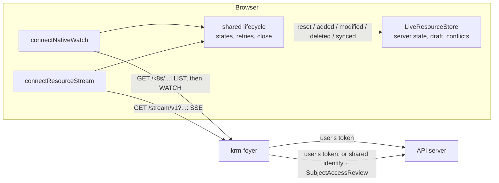

# Native watches from krm-stream: what changed, how it works, and adopting it

**Written 2026-10-06** against krm-stream `main` at `14d4ff4`, with gateway and npm
0.9.0 published and the 0.10.0 release pending in
[krm-stream#71](https://github.com/ConfigButler/krm-stream/pull/71). krm-foyer pins
**0.7.0** (Go gateway in `go.mod`, browser bundle in `Taskfile.yml`). Nothing here is
implemented in krm-foyer yet.

**Update 2026-10-06:** krm-stream 0.10.0 is released, and krm-foyer pins it: step 1
below is done, still on the gateway's SSE stream. Steps 2–5 remain.

## In short

On 2026-10-05 we asked krm-stream for a browser connector that reads a native
Kubernetes collection through a host proxy and feeds krm-stream's store and editor
([the request](krm-stream-native-connector-request.md)). krm-stream built it, in four
pieces:

1. **One connection lifecycle** shared by every connector (0.8.0, #53).
2. **`connectNativeWatch`**: LIST, then WATCH, through a proxy such as `/k8s`
   (0.8.0, #60).
3. **Native editing**: conditional merge PATCHes through the same proxy (0.8.0, #61).
4. **Resumed watches**: a dropped native watch picks up where it left off, with no
   new LIST and no new snapshot (0.10.0, #66, not yet released).

For krm-foyer this needs **no new route and no server change**: `/k8s` already serves
LIST and WATCH with the user's own token, inside the bounds. The work is a dependency
bump with renamed APIs (mechanical), an example page that uses the native connector,
browser specs that try to get past the session and RBAC boundaries, and docs that stop
calling the connector "requested".

**Recommendation:** adopt 0.10.0, not 0.9.0. Resuming
is what makes native watches cheaper than the gateway on reconnect, and the main reason
to offer them.

## What changed in krm-stream since 0.7.0

| Release | What | Effect on krm-foyer |
| --- | --- | --- |
| 0.8.0 | One browser connector, `connectResourceStream(url, callback)`; the old `connectManagedResourceStream(url, store)`, `onSynced`, `onStateChange` and friends are removed | The hello example must be rewritten to the new names |
| 0.8.0 | Gateway settings move into one embedded `gateway.StreamConfig`; `NewSharedBackendWithOptions` becomes `NewSharedBackend(upstream, options)` | `internal/stream/stream.go` and `shared.go` change, mechanically |
| 0.8.0 | `connectNativeWatch` with `nativeCollectionURL` | New: a native page needs no list/watch code of its own |
| 0.8.0 | Native editing with `nativeObjectURL`; `gateway.ValidateNativeMergePatch` for a host that wants to check patches | New; see [the patch check](#should-k8s-check-native-patches) |
| 0.8.0 | The store refuses edits to `metadata.managedFields` and the last-applied annotation under every policy; `annotations` is edited key by key | The hello example edits `spec` only, so unaffected |
| 0.8.0 | An exception in a callback, `subscribe` or `onError` stops the stream and rejects `closed` | Attach `connection.closed.catch(...)` |
| 0.9.0 | An example page for native editing | Nothing |
| 0.10.0 | Native watches resume from a checkpoint | The point of the exercise |

krm-stream's [upgrade guide](https://github.com/ConfigButler/krm-stream/blob/main/docs/migrating.md)
lists every rename.

## How it works now

### Two sources, one lifecycle, one store



Both connectors use `fetch`, so the session cookie goes along and no token reaches the
browser. Both hand the page the same five events and the same connection states
(`connecting`, `syncing`, `live`, `retrying`, `closed`, `terminal`, `exhausted`). The
page code that renders a list or an editor does not care which source fed the store.
What differs is what arrives:

| | Native (`/k8s`) | Gateway (`/stream/v1`) |
| --- | --- | --- |
| Objects | Exactly what the API server returns: `status`, `managedFields`, Secret values | A named view: `krm-full/v1`, `krm-spec/v1` or `krm-raw/v1`, machinery always removed |
| Updates | Every change | Changes to the view only (`krm-spec/v1` drops status-only updates) |
| Watches at the API server for N tabs on one scope | N | N, or 1 when the resource is shared |
| After a dropped connection | Resumes the watch: only what changed arrives | A fresh snapshot, every time |
| Who decides what the user sees | The API server, on the user's own request | The same, or a SubjectAccessReview when shared |

### The native connection, step by step

1. **LIST** the collection, e.g. `GET /k8s/apis/hello.krm-foyer.example/v1/namespaces/demo/notes`.
   The connector delivers `reset`, then `added` for every item. The state is `syncing`.
2. **WATCH** from the list's `resourceVersion`, with `allowWatchBookmarks=true` and the
   same selectors. Only once the API server accepts the WATCH does the connector deliver
   `synced` and become `live`. A page enables Save only while `live`.
3. **Live**: watch events become `added`, `modified`, `deleted`. Bookmarks change no
   object. After every event the store has applied, and every bookmark, the connector
   remembers that `resourceVersion` as its **checkpoint**.
4. **The watch ends** (krm-foyer's 30-minute response limit, the API server's own
   timeout, a network blip, a 5xx). The connector waits its backoff and opens
   `WATCH ?resourceVersion=<checkpoint>`. No LIST, no `reset`, no `synced`. The state
   goes `connecting` → `live`; the store keeps every object, draft and conflict, and
   what changed meanwhile arrives as ordinary events, deletions included.
5. **History expired** (HTTP or in-stream 410): the checkpoint is thrown away, and the
   connector goes back to step 1. The old objects stay visible until the new LIST is
   complete, and only then are the missing ones pruned.
6. **Refused** (401, 403, any other 4xx): terminal. No retry, no fallback to another
   source. The page shows why, and a new connection is the page's decision.

The checkpoint is private to the handle: never exposed, never accepted from the page,
never shared. So it cannot be replayed under another user's session or URL.

Two limits in this release: no **pagination** (a LIST that comes back with a
`continue` token is refused, terminally, before anything is applied) and no
**streaming lists** (`sendInitialEvents`). Both are planned upstream. krm-foyer does
not paginate unasked, so a collection is one page unless the page's code sets `limit`,
which the connector forbids anyway.

### Why a LIST first, and not a streaming list

A WATCH with `sendInitialEvents=true` would replace LIST + WATCH with one request.
krm-stream evaluated it and built LIST-then-WATCH first, because only that works
everywhere: an aggregated API server refused the streaming list on a real cluster
(`sendInitialEvents is forbidden for watch unless the WatchList feature gate is
enabled`, [observation F6](https://github.com/ConfigButler/krm-stream/blob/main/docs/facts/observed-v1.36.2+k3s1.md)),
so a streaming-list connector needs LIST-then-WATCH as its fallback anyway. With
resuming, a LIST is left only on the first connection and after a 410, which is all a
streaming list would make cheaper. It is planned
([proposal 0006, item 3](https://github.com/ConfigButler/krm-stream/blob/main/docs/proposals/0006-stream-and-save-implementation-plan.md)),
with its own rule: the snapshot is complete only at the `k8s.io/initial-events-end`
bookmark. Until then the connector refuses `sendInitialEvents` in a caller's URL.
Either way `/k8s` passes the request through unchanged.

### Where the gateway fits

The native path does not use the Go gateway: it is the browser, `/k8s` and the API
server. What the two paths share is browser code, the lifecycle and the store. The
gateway has no native handlers that change what a native watch does; its one native
function is `ValidateNativeMergePatch`, an optional check for a proxy
([not in `/k8s`](#should-k8s-check-native-patches)). In krm-foyer the gateway keeps
serving `/stream/v1`, for projected views and shared watches, unchanged.

### Native editing

The store and its four steps are the same as for a gateway page; what differs is who
writes the preconditions:

```js
const intent = store.captureSave(uid);               // before any await
if (intent) {
  const metadata = { ...intent.patch.metadata, uid: intent.uid, resourceVersion: intent.resourceVersion };
  // In krm-foyer: through foyer.js, which adds the CSRF proof a change needs.
  await k8s(nativeObjectURL('', { ...scope, namespace, name }), {
    method: 'PATCH', contentType: 'application/merge-patch+json',
    body: { ...intent.patch, metadata },
  });
}
```

The `uid` and `resourceVersion` inside the patch make the API server refuse it with
409 if anyone wrote in between, or if the object was replaced under the same name.
Because a native source suppresses nothing, the store always holds the latest version,
so the gateway's "quiet stream" 409 (status moved on unseen under `krm-spec/v1`)
does not happen here. A 409 is a real concurrent write.

## What improved, in numbers

From krm-stream's
[comparison run](https://github.com/ConfigButler/krm-stream/blob/main/docs/facts/comparison-2026-10-05.md),
real API server, 11 objects per subscriber, two forced reconnects per workload.
One machine, small collections: a witness, not a capacity figure.

**Resuming (0.10.0) against re-listing (0.9.0), native, 10 subscribers:**

| Workload | LISTs | Snapshots | KiB to the browser | Time back to `live` (median) |
| --- | --- | --- | --- | --- |
| quiet (only the reconnects) | 40 → 0 | 40 → 0 | 190 → 0 | 20 → 7.5 ms |
| churn (214 writes) | 40 → 0 | 40 → 0 | 2302 → 2113 | 13 → 6 ms |
| forced disconnect ×6 | 120 → 0 | 120 → 0 | 1295 → 723 | 12 → 5 ms |

What a reconnect saves is one LIST of the collection, so it grows with collection size
and reconnect frequency, not with the write rate. Every write still arrives once.

**Native against the gateway views, same workload, 10 subscribers:**

| Workload | Native | `krm-full/v1` | `krm-spec/v1` |
| --- | --- | --- | --- |
| quiet: KiB to the browser | 0 | 103 | 93 |
| churn: KiB to the browser | 2112 | 1100 | 152 |
| churn: object updates delivered | 2140 | 2138 | 150 |

So neither wins outright. Native is cheapest where little changes and connections
drop; the gateway is cheapest where a controller churns status, because it removes
`managedFields` and (with `krm-spec/v1`) status updates altogether. Shared gateway
watches cut API-server bytes tenfold in that run (2311 → 231 KiB); native never
shares.

## What it takes in krm-foyer

### 1. Bump krm-stream to 0.10.0 (mechanical, done)

- **Go**, `internal/stream/stream.go`: move `Authorizer`, `Clients`, `Projections`,
  `Diagnostics`, `WriteTimeout` and the reauthorization fields into
  `StreamConfig: gateway.StreamConfig{...}`. Assignments such as
  `opts.Authorizer = sh.authorize` keep working through field promotion.
  `internal/stream/shared.go`: `NewSharedBackendWithOptions` → `NewSharedBackend`.
  `ServeStream`/`Stream` signature changes do not touch krm-foyer, which uses
  `gateway.Handler`.
- **Browser**, `examples/hello/web/app.js`: `connectManagedResourceStream(url, store,
  {onSynced, onStateChange, onError})` becomes `connectResourceStream(url, event =>
  applyStreamEvent(store, event), {onError})`, with `connection.subscribe(showConnection)`
  for state and a `synced` event for the first snapshot. Add `closed.catch`.
- **Vendoring**: `KRM_STREAM_VERSION` and `KRM_STREAM_INTEGRITY` in `Taskfile.yml`,
  then `task vendor-krm-stream`.
- **Tests**: existing unit, e2e and browser specs should pass unchanged; that is the
  check that nothing behaves differently. No server behaviour changes.

Size: small. Commit as `fix(deps):` or `feat:`; krm-foyer's own interface does not
change.

### 2. Nothing new on the server

`/k8s` already does what the connector needs, checked against the code:

- **LIST and WATCH** pass through as the user, `FlushInterval: -1`, so each watch
  event reaches the browser as it arrives.
- **Bounds** already count a native watch as one concurrent request
  (64 per session, 2000 per replica by default), hold it to the 30-minute response
  duration, and abort it when the session ends. The response duration now works
  *with* the connector: the watch is cut, the connector resumes from its checkpoint,
  and the user sees nothing. The same goes for the 32 MiB response-bytes bound, which
  a long watch under churn can reach: cut, resumed, unnoticed.
- **Logout**: the session check aborts the watch; the connector tries to resume;
  krm-foyer answers 401; the connector stops, terminally. One request, no loop.
- **Request rate**: each resume is one request against the session's 20/s (burst 100),
  inside the connector's backoff and bounded retry budget.

#### Should `/k8s` check native patches?

krm-stream's guide says the host proxy should run `gateway.ValidateNativeMergePatch`
(both preconditions present, no machinery fields). **Recommendation: not in `/k8s`.**
`/k8s` is the Kubernetes API with the user's token and nothing more; refusing an
unconditional PATCH that RBAC allows is the second set of rules the
[design](../design.md#access) avoids, and it would break `kubectl`-style clients. The
check is not a security boundary either: the user can PATCH the same object without
the store. The store already refuses machinery edits, and the API server enforces the
preconditions when they are sent. Record this as a deliberate difference in
`docs/design.md` and say why.

### 3. A page that uses it

The hello example's notes are a small custom resource, which suits native access. Two
options:

- **A source switch on hello** (`?source=native`, default stays the gateway). One page,
  the same rendering and editing code, both sources under the same session, logout and
  RBAC specs. Shows the point "the page does not care which source" directly.
- **A second example.** Cleaner to read, but duplicates the page and its specs.

Recommendation: the switch. Writes on the native path go through `foyer.js`'s `k8s()`
with `nativeObjectURL('', ...)`, so the CSRF proof is added and 409/403 keep their
existing outcomes. A 409 recovers with a guarded native GET
(`store.captureReconciliation`), which `/k8s` serves as is; the gateway path keeps its
current "reopen and save again" recovery.

### 4. Specs that try to get past the boundaries

Browser specs (chromedp, label `browser`), each checked against a deliberately broken
example as the existing ones are:

- A change made elsewhere appears without a reload (native).
- **Resume**: the connection is cut (a short `-max-response-duration` in a dedicated
  spec, or the session-check abort path); the store keeps the draft, no new LIST
  reaches krm-foyer, and a change made during the gap arrives.
- **Logout** ends the native watch, and the resume attempt is refused once, terminally:
  no retry loop. The audit log witnesses no further watch for that user.
- **RBAC**: a user who may not list notes gets a terminal `FORBIDDEN` on the native
  source, and the page does **not** fall back to the gateway (and the gateway page does
  not fall back to native).
- **Conflict**: two users edit; the second native save gets 409 and keeps its draft.

The rehearsal (200 identities) stays gateway-only unless we decide to measure native
watches; [watches](../watches.md) says why they were not measured.

### 5. Docs that change in the same PR

- [watches.md](../watches.md): the native column becomes "krm-stream's native
  connector"; "requested, not yet shipped" goes; the choosing guide gains the
  trade-off from [the numbers](#what-improved-in-numbers).
- [bounds.md](../bounds.md#native-watches): the client library now exists; the
  response duration and logout behaviour above.
- [design.md](../design.md): the streams section, and the patch-check decision.
- [roadmap.md](../roadmap.md): a checked item under Streams.
- [The request](krm-stream-native-connector-request.md): marked delivered, with what
  was and was not (pagination, streaming lists).

### Worth checking while doing it

- **HTTP/2 in the e2e front door.** [ingress.md](../ingress.md) asks for HTTP/2 to the
  browser, because HTTP/1.1 allows six connections per origin and each watch holds
  one. `test/e2e/cluster/nginx-door.conf` says `listen 8443 ssl;` without `http2 on;`,
  so the fixture's browser may be on HTTP/1.1. krm-stream's comparison page hit exactly
  this: six streams, and the next save never left the browser. A page with a
  native and a gateway connection is fine; one with several collections is not.
- **Large collections.** Until krm-stream paginates, a native source is for
  collections that fit one LIST response under krm-foyer's 32 MiB response bound.

## What native watches do not give

Say these plainly in `watches.md`, so nobody picks native for the wrong reason:

- **No redaction.** A user who can read a Secret gets its values. That is RBAC's
  answer, not a leak, but a page that only needs to know a Secret *changed* should use
  `krm-full/v1`.
- **No suppression.** Every status update and every `managedFields` change reaches
  the browser and the store.
- **No sharing.** N tabs are N watches at the API server.
- **RBAC revocation** behaves as for a per-user stream: an open watch carries on until
  it ends. With krm-foyer's response bound that is at most 30 minutes; the resume is a
  new request, so the API server decides again at that point.

## Proposed order

1. **PR 1** (done): the bump (step 1). Existing specs
   prove nothing changed.
2. **PR 2**: the hello source switch, its specs and the doc updates (steps 3–5).

Both are small; PR 2 carries the risk, and its security specs are most of its size.
