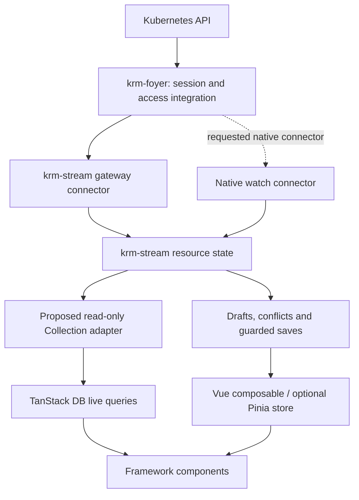

# Frontend integration: Pinia and TanStack DB

**Investigation and recommendation, 2026-10-05. No adapter is implemented by this
document.** Companion to [SSE and native watches](sse-and-native-watches.md) and the
[requests for krm-stream](krm-stream-native-connector-request.md).

## Recommendation

Both integrations are useful, for different reasons. Start with a tested Pinia
setup-store example built on krm-stream's existing Vue composable. Explore an
optional TanStack DB Collection adapter for live queries over resource collections.
Keep krm-stream responsible for editing in the first version of both integrations.

Pinia makes the library feel familiar to Vue developers: shared stores, reactive
getters, actions and form bindings. TanStack DB adds a capability beyond that:
incremental queries, sorting, joins and aggregations across live collections, with
framework adapters including Vue, React, Solid, Svelte and Angular. It already has
a documented integration point for external sync engines. See the
[TanStack DB overview](https://tanstack.com/db/latest/docs/overview) and the inspected
[collection adapter guide][db-adapter].

This is a recommendation based on documentation and source inspection, not a
performance result or proof that the proposed adapters compose correctly. No
upstream adapter suite or integration prototype was run for this investigation.

## What a frontender should get

The entry point should be a live collection and an editor, with predictable UI
state. For example: list Deployments in one namespace, filter and sort them, select
one, edit replicas, see someone else's changes and resolve a genuine disagreement.
The application should not have to implement watch recovery to build that screen.

| Choice | What it contributes | When to use it |
| --- | --- | --- |
| Vue composable alone | Reactive resource, draft, conflicts and connection state | A small Vue page or isolated editor |
| Pinia setup store using that composable | Shared application access and named domain actions | A Vue application already organized around Pinia |
| TanStack DB Collection adapter | Live queries over and across collections | Resource tables, dashboards and related-resource views |
| Pinia plus TanStack DB | Pinia for selection/workflow state; DB for queried resource rows | An application that needs both, without copying all query rows into Pinia |

Pinia is optional when using TanStack's Vue adapter. TanStack DB is optional when
using the krm-stream editor. Neither should become a dependency of foyer's server
or the framework-independent krm-stream core.

## Pinia: start with a setup store, then consider a plugin

krm-stream already provides a [Vue composable][krm-vue-source] exposing detached
snapshots of drafts, changes, conflicts and redactions, plus connection state. Its
tests are wired into krm-stream's checks. It handles one fixed UID and unsubscribes
when its Vue effect scope ends; its caller owns the connection. This is a useful
seed, not a complete collection/store integration.

Pinia [setup stores][pinia-setup] can call composables directly. An application can
therefore expose a familiar `useDeploymentsStore()` with actions for selecting,
editing and saving. A global plugin becomes useful if several stores need common
client injection or opt-in configuration. There is no need to start with one just
to make resource state reactive. Pinia documents those extension mechanisms in its
[plugin guide](https://pinia.vuejs.org/core-concepts/plugins.html).

The highest-value addition would be a field-binding helper. Its getter reads the
draft and its setter calls krm-stream's `setValue`, with corresponding explicit
operations for removal and conflict resolution. The existing [Vue guide][krm-vue]
warns against binding `v-model` directly to a draft snapshot: changing that detached
copy bypasses edit tracking and policy checks.

Keep the engine outside Vue's deep reactive proxies; use `markRaw` when exposing an
external class instance and shallow reactive snapshots for its changing views.
Use actions to edit through the engine. A deep watcher that translates arbitrary
Pinia mutations back into resource writes would create a second editing authority.

The example must make ownership concrete: a component unmount is not necessarily
store disposal, and one editor leaving must not close a shared connection. Test
store disposal, hot reload and logout. Begin with client-side streaming; SSR needs
request-scoped instances and an explicit hydration contract. Pinia's serialization,
devtools and persistence mechanisms do not automatically understand an external
engine or its network handles.

## TanStack DB: a Collection adapter is the natural extension

The inspected [Collection options creator guide][db-adapter] explicitly describes
integration with custom sync engines. Its [public sync interface][db-types] supplies
`begin`, `write`, `commit`, `markReady`, `markError`, `truncate` and cleanup. This is
a closer fit to a continuous resource stream than introducing a polling Query
Collection solely to receive watch events. Query Collections remain appropriate
for ordinary request/refetch screens.

The [Vue adapter][db-vue] exposes `useLiveQuery` results as computed refs. Components
can consume those results directly. For example, a Deployment table could join
Deployments to Namespace metadata, filter by an application label, and aggregate
counts per namespace. Join only collections the caller may actually read: a
namespace-limited user may not have permission to list Namespace objects.

A possible arrangement is:

The Collection materializes a queryable copy of authoritative resource state. That
extra memory and update work must earn its cost through useful queries. It is not
a reason to maintain another editable resource copy. For a page that only renders
one resource, the direct composable is likely enough.

### Proposed first adapter contract

Use a collection-options factory in a separate optional package or example. The
API name is undecided. Start with a complete, explicitly scoped collection rather
than promising query-driven remote subscriptions.

- **Identity:** use `metadata.uid` as the row key inside a source scope. The
  collection identity also includes API source, session ownership, resource type,
  namespace/selector and view. A name reused after deletion is a different object.
- **Rows:** mirror authoritative objects, not unsaved drafts. The current store's
  `server(uid)` returns the authoritative object as a copy. Use full row replacement
  (`rowUpdateMode: 'full'`) so removed fields do not survive as stale properties.
  Keep redaction metadata available to consumers; an absent value is not proof
  that a hidden field is unset.
- **Snapshots:** publish a completed initial snapshot, including an empty one,
  before declaring readiness. On reconnect, retain the previous snapshot as stale
  while collecting its replacement; replace membership only once complete. Do not
  clear a table on `reset` and expose a partially rebuilt table as current. Respect
  `commit()`'s applied receipt before signalling that the replacement is usable.
- **Updates:** apply later insert/update/delete batches to the Collection. New
  immutable row values must preserve deletions and avoid changing stored nested
  objects in place. A local draft edit must not publish as a server update.
- **Connection state:** expose stale/reconnecting, denied access and closed state
  alongside query results. Collection readiness alone does not establish that a
  watch is still live. `markError` handles failure to obtain an initial usable
  snapshot; later interruptions need the connector's lifecycle too.
- **Cleanup:** detach callbacks and release the owned connection or shared
  subscription. Late callbacks must not populate a disposed or different-session
  collection. Clear resource state on logout; a new session starts its own state.
- **Writes:** the first version supports querying these rows and uses krm-stream
  actions for editing. Document that Collection mutations are unsupported; do not
  install a no-op mutation handler that makes an edit look persisted.

The current store's [subscription API][krm-store] only says that something changed.
A proof of concept can compare `ids()`/`server(uid)` snapshots, but a full scan and
clone on every notification could erase the gains of incremental queries. Snapshot
completion also needs an explicit connector signal; a store notification is not
proof of complete membership. Investigate a public observation API for committed
resource changes, affected UIDs, snapshot boundaries and connection state. Do not
depend on private store fields or reproduce recovery inside each adapter.

A later read-only integration might consume the connector's normalized events
directly and avoid instantiating the editor store. Evaluate that against the
connector/store separation already requested upstream. It must retain membership
and recovery semantics; it does not justify another independent watch implementation.

### What a local query does not provide

A TanStack `.where(...)` or `.select(...)` operates over the adapter's data. It does
not automatically become a Kubernetes selector, reduce bytes received, or prevent
the browser from seeing excluded fields. Gateway scope, projection and suppression
still determine what crosses the network. Client query selection determines what
the page derives from those received objects.

TanStack supports on-demand loading through adapters, but the adapter/backend must
fulfil the requested predicates, ordering and windows. Kubernetes and the current
gateway do not implement arbitrary relational queries. Start with eager loading
of a bounded scope. Predicate pushdown would need a separate supported-subset
contract, with correct membership and explicit handling of unsupported queries.

Likewise, a status query cannot recover status omitted by `krm-spec/v1`; use a view
that includes it. Joins across independent watches are useful live views, not a
transactionally consistent cluster snapshot. Pinia and TanStack DB do not change
foyer's [authorization and projection boundaries](../design.md#selecting-a-live-view).

## Editing is the significant overlap

TanStack DB has optimistic transactions, mutation handlers, rollback and manual
transaction APIs. It can stage changes; the issue is not a lack of Save/Cancel
support. Its [mutation guide][db-mutations] makes handler-defined settlement
explicit: completing a handler proves backend confirmation only when the handler
actually waits for confirmation or a suitable read-back.

krm-stream already owns an editing model with server state, local drafts, merge
rules, field conflicts and redaction revisions. Connecting both mutation systems
without deciding which owns the edit would make it unclear what happens when a
remote change arrives during typing or a failed save rolls back.

| Integration | Assessment |
| --- | --- |
| TanStack reads authoritative rows; krm-stream owns editing | Recommended first experiment. Adds query capability with a clear owner for drafts and saves. |
| TanStack owns mutations; krm-stream supplies transport/view semantics | Plausible later for simple CRUD, but requires a specified conditional-write, conflict and settlement contract. It need not use the krm-stream editor. |
| Both systems independently stage and reconcile the same edits | Avoid. Two optimistic views can disagree about the submitted intent and current resource. |

For the first option, queries continue to show server state while a separate editor
shows unsaved work. Any future query over drafts should be explicitly named and
specified rather than silently turning drafts into authoritative rows.

A writable adapter needs to capture UID, resourceVersion, relevant base values and
submitted changes together. A `409` must distinguish stale version from changed
editable values, preserving later typing and requiring review for genuine conflicts.
Projected objects must not be submitted as full-resource replacements. A successful
write response, observing the write through a watch, and a controller finishing its
work remain distinct outcomes.

Do not wait indefinitely for an exact watch echo: suppression, no-op writes or a
later update can make that echo unavailable. Neither Pinia nor TanStack DB fixes
stale resourceVersions; the [save-progress request](krm-stream-native-connector-request.md#follow-up-3-reduce-save-interruptions-from-suppressed-updates)
still applies. A TanStack transaction over several resources also does not create
an atomic Kubernetes transaction; partial backend success needs explicit handling.

Durable caching, offline replay and SSR are separate adoption decisions. Their
availability in TanStack DB does not make Kubernetes write retries safe or grant a
cached object current authorization. Keep the first experiment in memory and online.

## Proposed work and ownership

1. **krm-stream: tested Vue/Pinia example.** Reuse the existing composable, add a
   collection plus selected editor, controlled field bindings and explicit save
   state. Exercise shared subscriptions, disposal, genuine conflicts and later
   typing during Save. Package the adapter when another application needs it.
2. **krm-stream: small TanStack read adapter experiment.** Demonstrate a scoped
   resource table and a two-collection query using authoritative rows. Verify empty
   initialization, field removal, missed deletes, UID replacement, resnapshot,
   denial, disposal and logout. Confirm that draft edits do not alter query rows.
   Use the experiment to assess whether public change notifications need improving.
3. **krm-foyer: authenticated end-to-end example.** Supply the existing session,
   gateway and write routes. Demonstrate login/expiry, read-only RBAC, projections
   and conflict UX. This is where the pieces come together; framework packages do
   not belong in the Go server.

Measure implementation size, added bundle size, retained memory, per-update work,
query/component notifications and watch counts against the direct composable. Use
identical object counts and churn, including irrelevant updates and reconnects.
Start with the existing gateway connector; the requested native connector is not a
prerequisite. Do not commit to a writable TanStack adapter before its ownership and
save contract have an executable demonstration.

## Source trail

The supplied checkouts were inspected at these commits. Package versions identify
the checked-in manifests, not a claim about the latest published release. Links are
pinned so this investigation remains useful without the ignored `external/` clones.

| Checkout | Inspected revision | Main evidence |
| --- | --- | --- |
| `external/pinia` | `98587ca465b2c45e4053548261e769cad380ba5a` (manifest 4.0.3) | Setup stores, plugins, external instances and store scope/disposal |
| `external/db` | `95c3f9ec9745f9f9dc44380e95f7106c46d20e59` (`@tanstack/db` manifest 0.11.3) | Collection adapter guide, public sync types, mutation semantics and Vue hook |
| `external/krm-stream` | `125e5e34a22a96430aaa20991e6017ffa52ee46e` | Vue composable/guide and public store methods; foyer pins 0.7.0 |

[pinia-setup]: https://github.com/vuejs/pinia/blob/98587ca465b2c45e4053548261e769cad380ba5a/packages/docs/core-concepts/index.md#setup-stores
[db-adapter]: https://github.com/TanStack/db/blob/95c3f9ec9745f9f9dc44380e95f7106c46d20e59/docs/guides/collection-options-creator.md
[db-types]: https://github.com/TanStack/db/blob/95c3f9ec9745f9f9dc44380e95f7106c46d20e59/packages/db/src/types.ts#L422
[db-vue]: https://github.com/TanStack/db/blob/95c3f9ec9745f9f9dc44380e95f7106c46d20e59/docs/framework/vue/overview.md
[db-mutations]: https://github.com/TanStack/db/blob/95c3f9ec9745f9f9dc44380e95f7106c46d20e59/docs/guides/mutations.md
[krm-vue]: https://github.com/ConfigButler/krm-stream/blob/125e5e34a22a96430aaa20991e6017ffa52ee46e/docs/vue.md
[krm-vue-source]: https://github.com/ConfigButler/krm-stream/blob/125e5e34a22a96430aaa20991e6017ffa52ee46e/examples/vue/useLiveResource.ts
[krm-store]: https://github.com/ConfigButler/krm-stream/blob/125e5e34a22a96430aaa20991e6017ffa52ee46e/packages/krm-stream/src/store.ts
