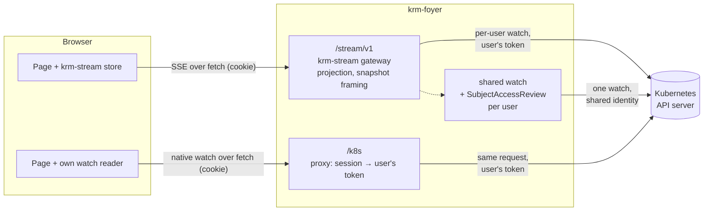
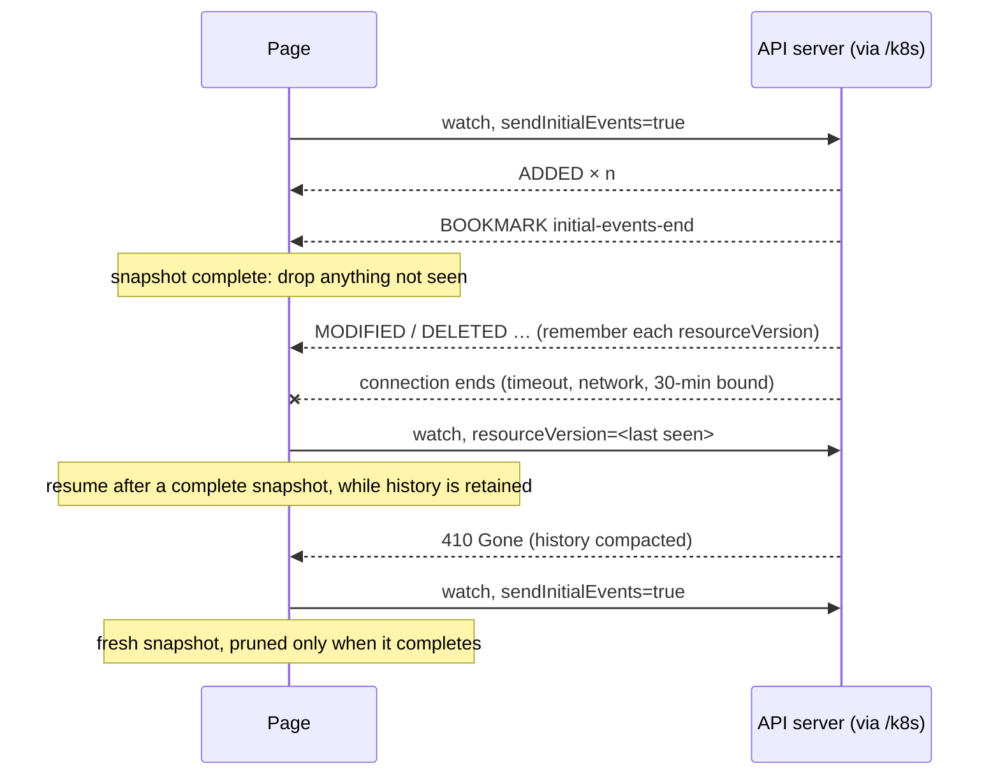
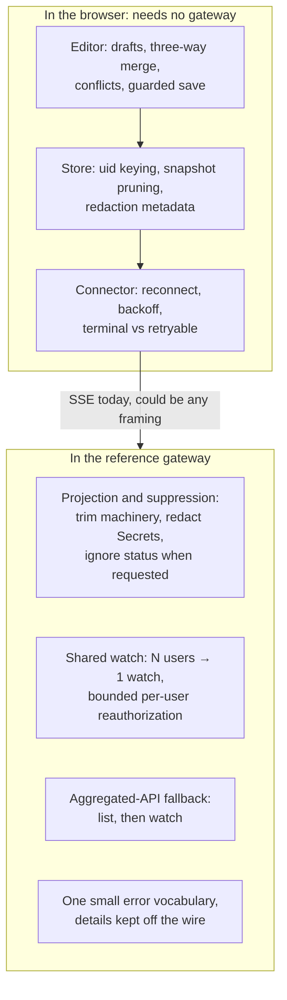

# Does a browser need SSE to watch Kubernetes?

**Investigation, 2026-10-04; direction clarified 2026-10-05.** Written while reviewing
krm-stream PRs #53–#55, which propose `connectResourceStream` (fetch) as the sole stream
connector and remove `connectWithEventSource`. Those PRs are still open as of this
update; krm-foyer pins 0.7.0. References below to the new connector describe that PR
design, not the released integration.

## The short answer

**No.** A browser can read either format with `fetch`. The hard part is keeping a
complete, usable resource view across interruptions and concurrent edits. Changing
SSE framing does not solve that work.

krm-stream is still useful, but not because of SSE. Its value is in two places that
have nothing to do with the wire format:

- **In the browser:** a store that stays correct across reconnects and missed deletes,
  plus the editor (drafts, three-way merge, conflicts, guarded saves).
- **On the server:** named projections, Secret redaction with change revisions,
  suppression of updates outside the selected view, shared watches with a revocation
  bound, and recovery for APIs that cannot stream their initial list.

## Direction: keep the gateway and add a native option

**krm-foyer brings browser access together; krm-stream supplies reusable live-resource
behavior.** Keep the reference Go gateway, protocol and browser library in krm-stream.
foyer integrates them with login, sessions, the native proxy and operational bounds.

Keep SSE on the gateway route. It is a small, conventional framing layer with an
existing implementation and conformance corpus. It remains useful to consumers that
already parse SSE; those consumers still need the resource-stream semantics. There
is no demonstrated benefit to a breaking replacement with newline-delimited JSON.

Support the simpler option by requesting a **native Kubernetes watch connector in
krm-stream**, feeding its browser store/editor through `/k8s` without gateway
projection or sharing. Native watches already work in foyer; this convenient browser
connector does not yet exist. Choosing it must be explicit: never silently fall back
from a redacted stream to native objects. The [upstream request](krm-stream-native-connector-request.md)
sets out the lifecycle and tests needed.

For a frontender, the intended choice is the view their page needs. A configuration
editor may ignore status churn; a progress screen needs status; a native resource
tool may want the original object. All need clear synchronization state, drafts that
survive updates, and understandable save conflicts.

The [Pinia and TanStack DB investigation](frontend-integrations-pinia-tanstack-db.md)
explores how to expose that behavior through familiar frontend stores and live
queries, while keeping framework dependencies optional and editing ownership clear.

## What "only the things I care about" already means

**Yes, there is a projection for ignoring status: `krm-spec/v1`.** This is implemented
in the pinned 0.7.0 gateway, independently of the pending connector changes.

| Choice | Existing behavior | Limit |
| --- | --- | --- |
| Scope | Select resource, namespace, name and optional label selector | Filters objects, not fields; no general field selectors in gateway v1 |
| `krm-full/v1` (default) | Keep status; omit Secret values and report their paths and change revisions | Does not recognize arbitrary sensitive fields in CRDs |
| `krm-spec/v1` | As full, but omit status and suppress status-only updates | No arbitrary list of field interests; use full if the page displays status |
| `krm-raw/v1` | Keep status and Secret values | Still strips `managedFields` and last-applied configuration; not native passthrough |
| Change suppression | Emit an object update only when its projected content excluding RV, or its redaction records, changes | Still emits all objects in each complete snapshot; does not reduce upstream watch traffic |

For example, a status-blind editor can request:

```http
GET /stream/v1?group=apps&version=v1&resource=deployments&namespace=app&projection=krm-spec%2Fv1
```

Redaction and ignoring have different meanings. An ignored status change produces no
object event. A hidden Secret value changing advances a `redacted[].rev`, so the UI
can show that it changed without receiving its contents. Those revisions belong to
one connection, not a durable history. All built-in projections trim `managedFields`
and the last-applied-configuration annotation.

This is useful even for one user: less payload, fewer browser updates, and no Secret
values in the default stream. In foyer it is not a confidentiality boundary against
the user, who may request the raw projection or `/k8s` if Kubernetes permits it.
Suppression can also leave a delivered RV stale, so guarded saves need reconciliation.
krm-stream already explains this in its saving guide and explicitly defers
version-only notifications and automatic conflict-free retries. The
[save-progress follow-up](krm-stream-native-connector-request.md#follow-up-3-reduce-save-interruptions-from-suppressed-updates)
records those sources and asks for an evaluation of bounded save recovery and
coalesced version delivery for this adopter use case.
See the [watch guide](../watches.md#choosing-a-projection) and krm-stream's
[implemented projection design](https://github.com/ConfigButler/krm-stream/blob/a8281c58ac6adcb0b59a4f66ac87bc21828d1e08/docs/proposals/0004-views-and-bytes.md).

krm-foyer already serves native watches through `/k8s`
([bounds](../bounds.md#native-watches)) and compares the paths in
[watches](../watches.md); krm-stream's gateway has opened its own upstream watches with
Kubernetes' streaming list from the start. What changed is that the one argument that
was about SSE itself, `EventSource`, is removed by the proposed connector change.

## How SSE got here

SSE was never chosen because a cookie could not be sent. It came with a different idea,
a shared-watch gateway, and the cookie requirement followed from SSE rather than the
other way round.

| When | Where | What was decided, and why |
|---|---|---|
| 2026-03-16 | voter, `docs/kubernetes-api-typescript.md`, `ARCHITECTURE.md` | Sessions are cookies from the first commit (`auth-service/session_cookie.go`). Browser watches are planned as "`fetch` streaming (`ReadableStream`) and parse event lines", but deferred: long-lived watches from a public audience were seen as a load and abuse risk, so poll first. |
| 2026-05-05 | voter `cc795e0`, `docs/kubernetes-watch-sse-gateway.md` | The SSE decision. Its title problem: "exposing Kubernetes-backed live state to browsers **without opening one Kubernetes watch per browser tab**". Goals: one watch per scope shared by N subscribers, `client-go` informers in the backend instead of "handwritten raw watch loops", "the browser uses simple `EventSource`" and relies on its automatic reconnect, normalized events instead of raw watch frames, authorization in one place. |
| 2026-07-11 | krm-stream seed `0f5c65b`, spec §7 | Extracted from voter and from a watch-to-SSE loop in gitops-api's console. Spec: SSE framing; "native `EventSource` cannot send custom request headers, **so** a v1 gateway MUST support same-origin session cookies"; bearer tokens optional, through a fetch-based reader. |

So the reasons, and what became of each:

| Original reason | Today |
|---|---|
| **One upstream watch for many tabs**: the main one, from voter, where a whole audience's phones watch the same quiz round | Still valid, and it is the gateway's job, not SSE's. It became opt-in: krm-foyer streams per-user by default and shares only configured resources. |
| **The backend owns watch mechanics** (informers, bookmarks, 410, resume) | Still valid for the server side. The browser side of the same work now lives in krm-stream's connector and store. |
| **The browser stays simple with `EventSource`** and its free reconnect | Removed in PR #53's design. Gap recovery and the server's retry hints needed a managed connector anyway. |
| **Normalized events, not raw watch frames** | Still valid: this is projection, plus the `reset`/`synced` vocabulary. Any framing would carry it. |
| **Cookies, because `EventSource` cannot send headers** | A consequence of choosing `EventSource`, never a limit of the browser: a same-origin `fetch` sends the session cookie by default, and krm-foyer's `/k8s` is cookie-authenticated too. |

SSE was the natural format for "the server pushes normalized events to a simple browser
client". The argument that carried the weight was sharing, and that argument still holds
for voter-like pages with one object and a large audience.

## The two wires, side by side

The same ConfigMap, first as the Kubernetes API server sends it through `/k8s`, then as
krm-stream sends it through `/stream/v1`.

**Native watch.** A request to the API server, through krm-foyer's proxy:

```http
GET /k8s/api/v1/namespaces/app/configmaps?watch=1&sendInitialEvents=true&resourceVersionMatch=NotOlderThan&allowWatchBookmarks=true
```

The response is `application/json`, chunked, one JSON object per line:

```json
{"type":"ADDED","object":{"apiVersion":"v1","kind":"ConfigMap","metadata":{"name":"app-config","namespace":"app","uid":"cm-app-0001","resourceVersion":"1001","managedFields":[…]},"data":{"replicas":"3"}}}
{"type":"BOOKMARK","object":{"kind":"ConfigMap","apiVersion":"v1","metadata":{"resourceVersion":"1001","annotations":{"k8s.io/initial-events-end":"true"}}}}
{"type":"MODIFIED","object":{…,"metadata":{…,"resourceVersion":"1002"},"data":{"replicas":"5"}}}
```

**krm-stream.** A request to the gateway:

```http
GET /stream/v1?version=v1&resource=configmaps&namespace=app
```

The response is `text/event-stream`:

```text
: connection 1

data: {"seq":1,"type":"reset","target":"demo","scope":{…},"projection":"krm-full/v1"}

data: {"seq":2,"type":"added","object":{…,"metadata":{"name":"app-config","uid":"cm-app-0001","resourceVersion":"1001"},"data":{"replicas":"3"}},"redacted":[]}

data: {"seq":3,"type":"synced"}

data: {"seq":4,"type":"modified","object":{…,"data":{"replicas":"5"}},"redacted":[]}
```

They are almost a translation of each other:

| Kubernetes watch | krm-stream | Difference |
|---|---|---|
| (request with `sendInitialEvents=true`) | `reset` | krm-stream says it explicitly |
| `ADDED` / `MODIFIED` | `added` / `modified` | the object is projected; updates with an unchanged visible view may be suppressed |
| `DELETED` | `deleted` | an identity instead of the last object |
| `BOOKMARK` with `k8s.io/initial-events-end` | `synced` | same meaning |
| other `BOOKMARK`s | no equivalent checkpoint on the wire | bookmarks advance upstream progress; SSE comments independently keep the downstream connection active |
| `ERROR` with a `Status` (410 Gone …) | `error` with a small code vocabulary | krm-stream classifies terminal or retryable |
| (none) | `seq` | lets the client detect a gap in the gateway's own output |

The SSE features that would make SSE more than framing are deliberately unused:
krm-stream's [spec](https://github.com/ConfigButler/krm-stream/blob/main/spec/v1.md)
forbids `id:` lines and `Last-Event-ID` resume, and no event names are used. In
krm-stream PR #53's design, `EventSource`'s automatic reconnect is not used either.

## Why it felt as if SSE were needed

Each reason was true for some design; none holds for krm-foyer as built.

| The reason | What actually holds |
|---|---|
| "`EventSource` cannot read a Kubernetes watch." | `fetch` reads either streamed body; PR #53 makes it the sole stream connector. |
| "`EventSource` cannot send a bearer token." | True, and irrelevant behind a backend: krm-foyer's session cookie goes with every same-origin `fetch`, and `/k8s` attaches the user's token on the server. The token never reaches the browser on either path. |
| "The API server does not allow cross-origin browser requests." | No API-server CORS configuration is needed for either path: the browser talks to same-origin krm-foyer. |
| "The browser handles SSE reconnects for you." | Only with `EventSource`; the connector proposed in #53 manages recovery and retry hints itself. |
| "Proxies and the 6-connections-per-host limit treat SSE better." | The connection limit applies to every long response alike; HTTP/2 lifts it for both. The `text/event-stream` type does help a little: some proxies and compression middleware recognise it and do not buffer. |
| "Idle connections get cut." | The gateway sends SSE heartbeat comments. Ordinary Kubernetes bookmarks have no guaranteed interval or delivery and are not a reliable heartbeat. Both clients need recovery. |

## Three ways a page can get live state through krm-foyer

All three server paths exist today ([watches](../watches.md)). Shared streams also
add per-user access reviews and a revocation bound; native browser integration still
requires a client implementing the watch lifecycle.



## What a page must do with a native watch

The API server gives a correct stream of changes. Keeping a correct copy from it is the
client's job, which `client-go` calls a reflector. In a browser that job is:



The rules a correct reader follows:

1. Split the body into lines, keeping a partial line until the next chunk.
2. Key objects by `metadata.uid`, never by name, so a recreated object does not inherit
   an old one's state.
3. Track snapshot completion separately from `resourceVersion`. Initial synthetic
   `ADDED` events do not establish a complete collection or a safe resume checkpoint.
4. After a complete snapshot, remember the last applied event or bookmark's
   `resourceVersion`. Resume from it with bounded backoff when the response ends.
   If the snapshot ends early, restart the snapshot instead.
5. On 410 Gone, at opening or as an `ERROR` event, start a fresh snapshot. Keep the old
   objects until it completes, then remove every object it did not send. That is how a
   delete missed during the gap disappears.
6. Report 401 and 403 as terminal for this connection, both as opening HTTP statuses
   and in-stream `ERROR` events. A later login can start a new connection.
7. Aggregated APIs may refuse `sendInitialEvents` (krm-stream's observation F6). For
   them, list first, then watch from the list's `resourceVersion`.

The original untested JavaScript sketch has been removed: it resumed after an
incomplete initial snapshot and retried in-stream 403 errors. It also lost checkpoint
progress when a body read threw. A short parser is not evidence of a complete connector.
PR #53's proposed plain `ResourceStateEvent` input makes reuse of the browser store
plausible; the [connector request](krm-stream-native-connector-request.md) requires
tests for the full lifecycle and the raw-object editing contract.

Native resume can avoid a full snapshot while the checkpoint is retained. Reopening
and replay still cost work, and a 410 requires resynchronization. A browser reconnect
to the current gateway always receives a new snapshot. The upstream continuation
design in [PR #59](https://github.com/ConfigButler/krm-stream/pull/59) addresses a
different boundary: reopening the gateway's Kubernetes watch while the browser stays
connected. Neither is a reason to change SSE framing.

## What krm-stream adds, layer by layer



| Feature | Native watch + reader | Per-user stream | Shared stream |
|---|---|---|---|
| Access decided by | API server | API server | API server, via SubjectAccessReview |
| RBAC revocation reaches an open watch | when it ends (≤ 30 min in krm-foyer) | when it ends | within about a minute |
| Watches at the API server for N users of one scope | N | N | 1 per replica |
| Browser reconnect cost | reopen and replay; snapshot if history expired | full snapshot | full snapshot |
| `managedFields` and other noise | sent | removed | removed |
| Secrets | as RBAC allows | redacted by default | redacted by default |
| Aggregated API without streaming list | the reader must list, then watch | handled | handled |
| Status-only update suppression | none on the wire | `krm-spec/v1` | `krm-spec/v1` |
| Store, editor, conflicts | requested connector; raw-view contract needs validation | krm-stream store | krm-stream store |
| Extra server component | none | gateway | gateway + shared identity |

The gateway's projection happens before bytes reach the browser, and sharing needs
a server. List/watch fallback and error classification can also be implemented in a
native client; their existing implementation is a convenience of the gateway.
Redaction remains useful for limiting what a page receives even though foyer permits
authorized raw reads ([design](../design.md#streams-and-editing)).

## Is `EventSource` a nice interface for frontenders?

It is useful when its request and recovery behavior fit the application. It sits one
level below the live-resource interface considered here.

### Why it appeals

- **Three lines, built in, no library.**
  [`new EventSource(url)`](https://developer.mozilla.org/en-US/docs/Web/API/EventSource/EventSource),
  then [`onmessage`](https://developer.mozilla.org/en-US/docs/Web/API/EventSource/message_event).
  It looks great on a slide.
- **It reconnects by itself**, and sends cookies: same-origin always, cross-origin with
  `withCredentials`.
- **DevTools shows each message** in an EventStream tab of the request.
- **Frontenders know SSE already,** mostly from LLM APIs, which stream their answers as
  SSE. They read those with `fetch`, though, because `EventSource` cannot `POST` or set a
  header.

MDN's [Using server-sent events](https://developer.mozilla.org/en-US/docs/Web/API/Server-sent_events/Using_server-sent_events)
is the friendly introduction; the
[WHATWG HTML standard](https://html.spec.whatwg.org/multipage/server-sent-events.html)
has the exact rules quoted below.

### Where it lets a real application down

- **Errors carry no information.** The
  [`error` event](https://developer.mozilla.org/en-US/docs/Web/API/EventSource/error_event)
  is a plain `Event`: no status code, no response body, no `Retry-After`. All a page can
  see is [`readyState`](https://developer.mozilla.org/en-US/docs/Web/API/EventSource/readyState).
- **What happens next depends on things the page cannot see.** Per the standard:
  - A response that is not `200`, or not `text/event-stream`, **fails the connection for
    good.** That covers 401 and 403, which is right, but also a 503 during a deploy,
    which the page then has to notice and reopen itself, without knowing which it was.
  - A network error, or the end of a stream that opened fine, **reconnects** after the
    "reconnection time": browser-defined, settable by the server with a `retry:` line.
    Backoff is optional for the browser, and the page has no retry budget.
  - So a gateway that refuses in band (a `200` stream carrying an error event, then
    closed) gets reconnected to, over and over, from every open tab. That is the warning
    that headed krm-stream's old `sse.ts`, and why its connector closes the
    `EventSource` itself on a terminal error.
  - `204 No Content` is the explicit stop-reconnecting response; the other failure
    statuses above also fail the connection.
- **The request is fixed:** `GET` only, no headers, no body. A bearer token cannot be
  sent ([MDN](https://developer.mozilla.org/en-US/docs/Web/API/EventSource)).
- **The connection limit:** over HTTP/1.1 a browser opens at most six connections per
  origin, and every open `EventSource` holds one. MDN warns about this on the
  `EventSource` page; HTTP/2 lifts it. (It applies to a streaming `fetch` just the same.)
- **The popular workaround replaces it.** Microsoft's
  [`fetch-event-source`](https://github.com/Azure/fetch-event-source) is SSE parsing on
  top of `fetch`, written because of the limits above. krm-stream made the same move in
  PR #53.

### The `fetch` version, for comparison

Everything `EventSource` hides, `fetch` exposes:
[`Response.status`](https://developer.mozilla.org/en-US/docs/Web/API/Response/status),
the headers, the body of a refusal, and the stream itself through
[`Response.body`](https://developer.mozilla.org/en-US/docs/Web/API/Response/body)
([using readable streams](https://developer.mozilla.org/en-US/docs/Web/API/Streams_API/Using_readable_streams),
[`TextDecoderStream`](https://developer.mozilla.org/en-US/docs/Web/API/TextDecoderStream)).
Cookies follow [`credentials`](https://developer.mozilla.org/en-US/docs/Web/API/RequestInit#credentials),
`same-origin` by default. Cancellation is an
[`AbortController`](https://developer.mozilla.org/en-US/docs/Web/API/AbortController).
The price is that reconnecting, backoff and line splitting are the page's job, or a
library's.

## What frontenders actually want: a live value

A frontender does not want a stream of events. They want a value that stays correct:
"give me these notes, keep them current, tell me when they change, and let me edit one
without losing what I typed." `EventSource` and `fetch` are both one level below that.

### `onSnapshot` and its relatives

Firestore's [`onSnapshot`](https://firebase.google.com/docs/firestore/query-data/listen)
is the best-known shape:

```js
const stop = onSnapshot(query(collection(db, 'notes'), where('team', '==', 'a')), { includeMetadataChanges: true }, (snap) => {
  render(snap.docs);                    // the whole current result, every time
  for (const change of snap.docChanges()) animate(change.type, change.doc); // added | modified | removed
  showSaving(snap.metadata.hasPendingWrites); // local edits not yet confirmed
  showCached(snap.metadata.fromCache);        // cache-sourced, not proof of being offline
});
```

What makes it pleasant is not the transport (Firestore uses its own), but four promises:

1. **The callback always gets the complete current state,** not a delta to apply.
2. **It also says what changed,** for animation and highlighting.
3. **It says whether the data is confirmed:** `fromCache` and `hasPendingWrites`.
4. **Unsubscribing is one function call.**

krm-stream addresses related UI needs, but these are comparisons, not equivalent APIs:

| `onSnapshot` | krm-stream |
|---|---|
| `snap.docs` | `store.ids()` + `store.server(uid)` |
| `docChanges()` | the `StreamChange` returned per event: `uid`, `added`, `flashed`, `structural` |
| `metadata.fromCache` | synchronization/connection state helps describe freshness; it is not a persistent offline-cache contract |
| `metadata.hasPendingWrites` | a dirty draft is unsaved intent, not an in-flight write; save lifecycle needs separate state |
| local writes appear at once ("latency compensation") | local draft and authoritative resource remain separate; reconcile write receipts and watch observations with guards |
| `unsubscribe()` | `connection.close()` and the store's unsubscribe |

The separation helps when controllers and other people change an object while the
page edits it, and admission may reject or rewrite a save. Optimistic UI can also be
honest about pending writes, as Firestore's metadata shows. The desired frontend
contract distinguishes dirty drafts, submitting, accepted writes, observed state and
domain completion. A watch echo alone is not a general proof of a particular save:
another update may already have superseded it, and suppression may omit a no-op.

Others in the same family:

- **Supabase Realtime**
  ([Postgres changes](https://supabase.com/docs/guides/realtime/postgres-changes))
  supplies change notifications, not a complete synchronized query result. Combining
  a query with subscriptions needs a reconciliation strategy; simply loading rows
  then subscribing leaves a gap. Kubernetes streaming lists provide an explicit
  snapshot boundary in the change stream.
- **ElectricSQL** ([HTTP API](https://electric-sql.com/docs/api/http)) syncs a "shape"
  as an initial snapshot plus a log, resumed from an offset: very close to Kubernetes'
  list plus watch from a `resourceVersion`.

### Is there an open standard?

Not for the part that matters. The pieces around it are standardized; the contract in
the middle is not.

| Layer | Standards | Status |
|---|---|---|
| Transport | [SSE](https://html.spec.whatwg.org/multipage/server-sent-events.html) (WHATWG), [WebSocket](https://www.rfc-editor.org/rfc/rfc6455) (RFC 6455), [Fetch](https://fetch.spec.whatwg.org/) and [Streams](https://streams.spec.whatwg.org/) (WHATWG), [WebTransport](https://www.w3.org/TR/webtransport/) (W3C draft) | Mature, except WebTransport |
| Change format | [JSON Patch](https://www.rfc-editor.org/rfc/rfc6902) (RFC 6902), [JSON Merge Patch](https://www.rfc-editor.org/rfc/rfc7396) (RFC 7396) | Mature; Kubernetes accepts both for writes |
| Event envelope | [CloudEvents](https://cloudevents.io/) (CNCF) | Mature, but describes single events, not state |
| Query subscriptions | GraphQL [subscriptions](https://spec.graphql.org/October2021/#sec-Subscription) | The operation is specified; the transport (`graphql-ws`, `graphql-sse`) and "live queries" are not |
| **Snapshot, then changes, then resume or resnapshot** | [Braid-HTTP](https://datatracker.ietf.org/doc/draft-toomim-httpbis-braid-http/) | An individual IETF Internet-Draft, not adopted by a working group |
| Reactive values in JavaScript | [TC39 Signals](https://github.com/tc39/proposal-signals), [WICG Observable](https://github.com/WICG/observable) | Proposals: Signals is at stage 1; Observable is incubating in WICG |

So every product (Firestore, Supabase, Electric, Convex, Replicache) defines its own
sync contract. Of the openly documented ones, Kubernetes'
[list and watch](https://kubernetes.io/docs/reference/using-api/api-concepts/#efficient-detection-of-changes)
is one of the most precise: versioned changes, bookmarks, a defined "too old, start
again" (410 Gone), and since
[streaming lists](https://kubernetes.io/docs/reference/using-api/api-concepts/#streaming-lists)
a snapshot boundary in the same stream. krm-stream builds on that model and adds its
own declared view, suppression, redaction and recovery contract.

For krm-stream this points to a clear target: its store, wrapped in a framework hook,
should feel like `onSnapshot`. The Vue example's `useLiveResource` is already shaped
that way. If TC39 Signals land, the store is a natural thing to expose as one.

## What this means

- **Keep the reference gateway in krm-stream and integrate it in krm-foyer.** It makes
  the resource-stream contract usable by foyer and other hosts.
- **Keep SSE as the gateway encoding.** Reconsider only with evidence of a problem
  that changing framing solves. A native connector is a separate access option.
- **Make projections and suppression part of the pitch.** They help even a single
  user, and are already implemented. Explain precisely which objects, fields and
  updates a page can select.
- **Request the native connector in krm-stream.** Reuse browser primitives, keep raw
  semantics explicit, and test recovery and guarded editing before promising parity.
- **Demonstrate a frontend outcome.** Show controller progress, a status-blind editor,
  a hidden Secret rotation and recovery from a missed delete. Compare native and
  projected paths under the same workload, including bytes, browser updates and save
  conflicts. The [request](krm-stream-native-connector-request.md) defines that work.
