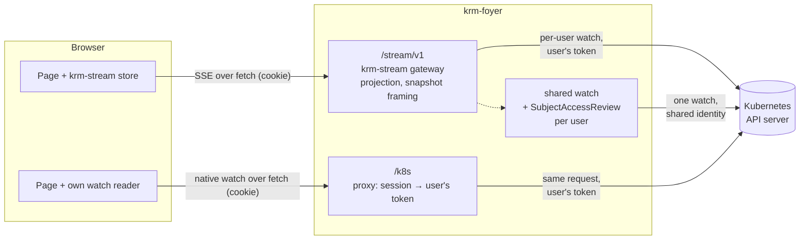
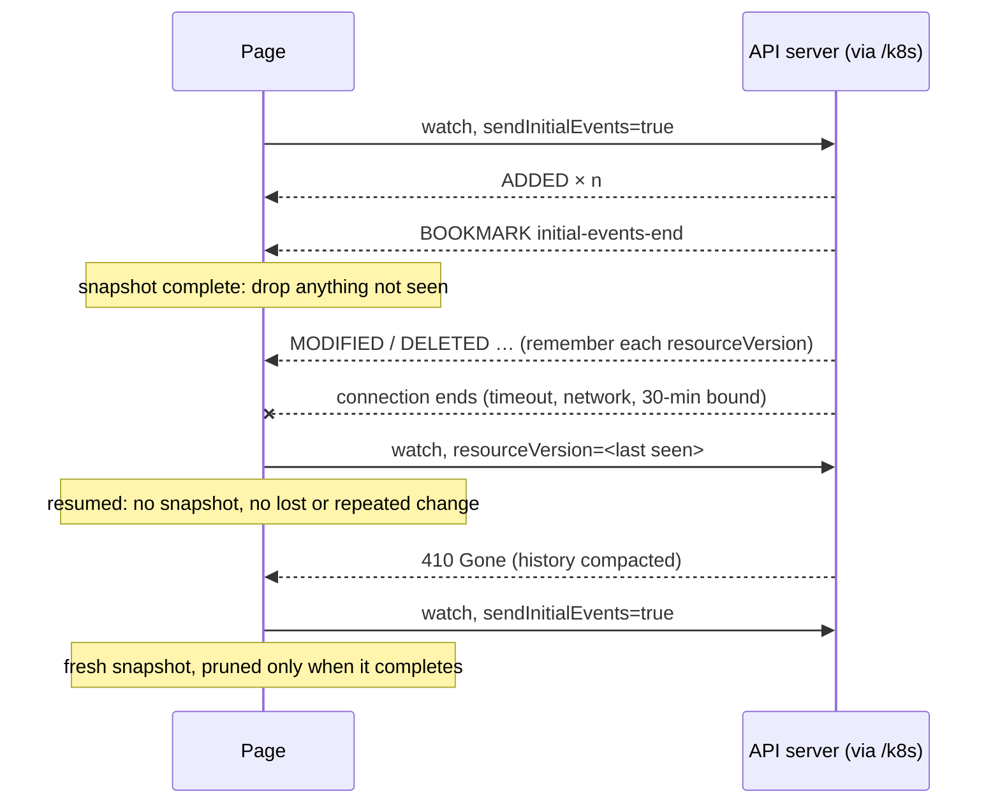
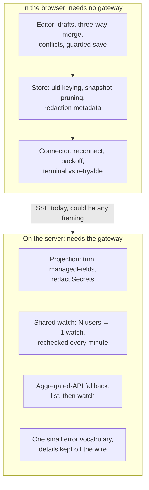

# Does a browser need SSE to watch Kubernetes?

**Investigation, 2026-10-04.** Written while reviewing krm-stream PRs #53–#55, which
made `connectResourceStream` (fetch) the only browser connector and removed
`connectWithEventSource`. It asks what the SSE format still contributes, and what
krm-stream contributes once SSE is set aside.

## The short answer

**No.** A browser can read a Kubernetes watch with `fetch` as easily as it reads an SSE
stream. krm-stream itself now reads its SSE stream with `fetch`, not `EventSource`, so
the format is only framing: `data: {json}` and a blank line instead of `{json}` and a
newline.

krm-stream is still useful, but not because of SSE. Its value is in two places that
have nothing to do with the wire format:

- **In the browser:** a store that stays correct across reconnects and missed deletes,
  plus the editor (drafts, three-way merge, conflicts, guarded saves).
- **On the server:** projection, shared watches with a revocation bound, and a fallback
  for aggregated APIs that cannot stream their initial list.

None of this is new information. krm-foyer already serves native watches through `/k8s`
([bounds](../bounds.md#native-watches)) and compares the paths in
[watches](../watches.md); krm-stream's gateway has opened its own upstream watches with
Kubernetes' streaming list from the start. What changed is that the one argument that
was about SSE itself, `EventSource`, is gone.

## How SSE got here

SSE was never chosen because a cookie could not be sent. It came with a different idea,
a shared-watch gateway, and the cookie requirement followed from SSE rather than the
other way round.

| When | Where | What was decided, and why |
|---|---|---|
| 2026-03-16 | voter, `docs/kubernetes-api-typescript.md`, `ARCHITECTURE.md` | Sessions are cookies from the first commit (`auth-service/session_cookie.go`). Browser watches are planned as "`fetch` streaming (`ReadableStream`) and parse event lines", but deferred: long-lived watches from a public audience were seen as a load and abuse risk, so poll first. |
| 2026-05-05 | voter `cc795e0`, `docs/kubernetes-watch-sse-gateway.md` | The SSE decision. Its title problem: "exposing Kubernetes-backed live state to browsers **without opening one Kubernetes watch per browser tab**". Goals: one watch per scope shared by N subscribers, `client-go` informers in the backend instead of "handwritten raw watch loops", "the browser uses simple `EventSource`" and relies on its automatic reconnect, normalized events instead of raw watch frames, authorization in one place. |
| 2026-07-11 | krm-stream seed `0f5c65b`, spec §7 | Extracted from voter and from a watch-to-SSE loop in gitops-api's console. Spec: SSE framing; "native `EventSource` cannot send custom request headers, **so** a v1 gateway MUST support same-origin session cookies"; bearer tokens optional, through a fetch-based reader. |

So the reasons, and what became of each:

| Original reason | Today |
|---|---|
| **One upstream watch for many tabs**: the main one, from voter, where a whole audience's phones watch the same quiz round | Still valid, and it is the gateway's job, not SSE's. It became opt-in: krm-foyer streams per-user by default and shares only configured resources. |
| **The backend owns watch mechanics** (informers, bookmarks, 410, resume) | Still valid for the server side. The browser side of the same work now lives in krm-stream's connector and store. |
| **The browser stays simple with `EventSource`** and its free reconnect | Gone. Gap recovery and the server's retry hints needed a managed connector anyway, and #53 removed `EventSource` from the client. |
| **Normalized events, not raw watch frames** | Still valid: this is projection, plus the `reset`/`synced` vocabulary. Any framing would carry it. |
| **Cookies, because `EventSource` cannot send headers** | A consequence of choosing `EventSource`, never a limit of the browser: a same-origin `fetch` sends the session cookie by default, and krm-foyer's `/k8s` is cookie-authenticated too. |

SSE was the natural format for "the server pushes normalized events to a simple browser
client". The argument that carried the weight was sharing, and that argument still holds
for voter-like pages with one object and a large audience.

## The two wires, side by side

The same ConfigMap, first as the Kubernetes API server sends it through `/k8s`, then as
krm-stream sends it through `/stream/v1`.

**Native watch.** A request to the API server, through krm-foyer's proxy:

```http
GET /k8s/api/v1/namespaces/app/configmaps?watch=1&sendInitialEvents=true&resourceVersionMatch=NotOlderThan&allowWatchBookmarks=true
```

The response is `application/json`, chunked, one JSON object per line:

```json
{"type":"ADDED","object":{"apiVersion":"v1","kind":"ConfigMap","metadata":{"name":"app-config","namespace":"app","uid":"cm-app-0001","resourceVersion":"1001","managedFields":[…]},"data":{"replicas":"3"}}}
{"type":"BOOKMARK","object":{"kind":"ConfigMap","apiVersion":"v1","metadata":{"resourceVersion":"1001","annotations":{"k8s.io/initial-events-end":"true"}}}}
{"type":"MODIFIED","object":{…,"metadata":{…,"resourceVersion":"1002"},"data":{"replicas":"5"}}}
```

**krm-stream.** A request to the gateway:

```http
GET /stream/v1?version=v1&resource=configmaps&namespace=app
```

The response is `text/event-stream`:

```text
: connection 1

data: {"seq":1,"type":"reset","target":"demo","scope":{…},"projection":"krm-full/v1"}

data: {"seq":2,"type":"added","object":{…,"metadata":{"name":"app-config","uid":"cm-app-0001","resourceVersion":"1001"},"data":{"replicas":"3"}},"redacted":[]}

data: {"seq":3,"type":"synced"}

data: {"seq":4,"type":"modified","object":{…,"data":{"replicas":"5"}},"redacted":[]}
```

They are almost a translation of each other:

| Kubernetes watch | krm-stream | Difference |
|---|---|---|
| (request with `sendInitialEvents=true`) | `reset` | krm-stream says it explicitly |
| `ADDED` / `MODIFIED` | `added` / `modified` | the object is projected (no `managedFields`, Secrets redacted) |
| `DELETED` | `deleted` | an identity instead of the last object |
| `BOOKMARK` with `k8s.io/initial-events-end` | `synced` | same meaning |
| other `BOOKMARK`s | heartbeat comments | both keep the connection busy |
| `ERROR` with a `Status` (410 Gone …) | `error` with a small code vocabulary | krm-stream classifies terminal or retryable |
| (none) | `seq` | lets the client detect a gap in the gateway's own output |

The SSE features that would make SSE more than framing are deliberately unused:
krm-stream's [spec](https://github.com/ConfigButler/krm-stream/blob/main/spec/v1.md)
forbids `id:` lines and `Last-Event-ID` resume, and no event names are used. Since
krm-stream PR #53, `EventSource`'s automatic reconnect is not used either.

## Why it felt as if SSE were needed

Each reason was true for some design; none holds for krm-foyer as built.

| The reason | What actually holds |
|---|---|
| "`EventSource` cannot read a Kubernetes watch." | True, and irrelevant: `fetch` reads any streamed body, and krm-stream's own client uses `fetch` now. |
| "`EventSource` cannot send a bearer token." | True, and irrelevant behind a backend: krm-foyer's session cookie goes with every same-origin `fetch`, and `/k8s` attaches the user's token on the server. The token never reaches the browser on either path. |
| "The API server does not allow cross-origin browser requests." | True, and the same for both: the browser talks to krm-foyer, never to the API server. |
| "The browser handles SSE reconnects for you." | Only with `EventSource`, which krm-stream stopped using because its reconnect timing ignores the server's retry hints. |
| "Proxies and the 6-connections-per-host limit treat SSE better." | The connection limit applies to every long response alike; HTTP/2 lifts it for both. The `text/event-stream` type does help a little: some proxies and compression middleware recognise it and do not buffer. |
| "Idle connections get cut." | Both have a keep-alive: SSE comments every 20 s, Kubernetes bookmarks about once a minute (not guaranteed). Both clients reconnect anyway. |

## Three ways a page can get live state through krm-foyer

All three exist today ([watches](../watches.md)). The only difference between the
first two is who opens the watch at the API server.



## What a page must do with a native watch

The API server gives a correct stream of changes. Keeping a correct copy from it is the
client's job, which `client-go` calls a reflector. In a browser that job is:



The rules a correct reader follows:

1. Split the body into lines, keeping a partial line until the next chunk.
2. Key objects by `metadata.uid`, never by name, so a recreated object does not inherit
   an old one's state.
3. Remember the `resourceVersion` of every event, bookmarks included.
4. When the response ends, reconnect from that `resourceVersion`, with backoff.
5. On 410 Gone, at opening or as an `ERROR` event, start a fresh snapshot. Keep the old
   objects until it completes, then remove every object it did not send. That is how a
   delete missed during the gap disappears.
6. Stop on 401 and 403; retrying cannot help.
7. Aggregated APIs may refuse `sendInitialEvents` (krm-stream's observation F6). For
   them, list first, then watch from the list's `resourceVersion`.

That is about a hundred lines. Because krm-stream PR #53 made the store's input a plain
event (`ResourceStateEvent`), such a reader can feed krm-stream's store and editor
directly, with no gateway in between. **An untested sketch:**

```js
import { LiveResourceStore, applyStreamEvent } from './krm-stream.js';

const store = new LiveResourceStore();
const consume = (event) => render(applyStreamEvent(store, event));

// Follow one collection, e.g. '/k8s/api/v1/namespaces/app/configmaps'.
async function followNative(path, signal) {
  let rv = ''; // empty: the next connection starts with a snapshot
  let failures = 0;
  while (!signal.aborted) {
    const q = new URLSearchParams({ watch: '1', allowWatchBookmarks: 'true' });
    if (rv) {
      q.set('resourceVersion', rv);
    } else {
      q.set('sendInitialEvents', 'true');
      q.set('resourceVersionMatch', 'NotOlderThan');
      consume({ type: 'reset' }); // nothing is dropped until `synced`
    }
    try {
      const res = await fetch(`${path}?${q}`, { signal });
      if (res.status === 401 || res.status === 403) throw new Error('refused'); // rule 6
      if (res.status === 410) { rv = ''; continue; }                            // rule 5
      if (!res.ok) throw Object.assign(new Error(`HTTP ${res.status}`), { retry: true });
      rv = await readEvents(res.body, rv, consume);
      failures = 0;
    } catch (err) {
      if (!err.retry && err.name !== 'TypeError') throw err; // TypeError: network failure
      failures++;
    }
    await sleep(Math.min(30_000, 500 * 2 ** failures) * (0.5 + Math.random() / 2)); // rule 4
  }
}

// Returns the resourceVersion to resume from, or '' when a fresh snapshot is needed.
async function readEvents(body, rv, consume) {
  const reader = body.pipeThrough(new TextDecoderStream()).getReader();
  let buffer = '';
  for (;;) {
    const { done, value } = await reader.read();
    if (done) return rv;                                   // ended: resume from rv
    buffer += value;
    let newline;
    while ((newline = buffer.indexOf('\n')) >= 0) {        // rule 1
      const line = buffer.slice(0, newline);
      buffer = buffer.slice(newline + 1);
      if (!line) continue;
      const { type, object } = JSON.parse(line);
      if (type === 'ERROR') {
        await reader.cancel();
        return object.code === 410 ? '' : rv;              // rule 5
      }
      rv = object.metadata.resourceVersion;                // rule 3
      const m = object.metadata;
      if (type === 'ADDED') consume({ type: 'added', object });
      else if (type === 'MODIFIED') consume({ type: 'modified', object });
      else if (type === 'DELETED') consume({ type: 'deleted', identity: {
        uid: m.uid, name: m.name, namespace: m.namespace,
        apiVersion: object.apiVersion, kind: object.kind } });
      else if (type === 'BOOKMARK' && m.annotations?.['k8s.io/initial-events-end'] === 'true')
        consume({ type: 'synced' });                       // snapshot complete: prune
    }
  }
}

const sleep = (ms) => new Promise((resolve) => setTimeout(resolve, ms));
```

Note one thing the native path does *better*: a reconnect resumes from the last
`resourceVersion` and costs nothing, while every krm-stream reconnect transfers a full
snapshot ([spec](https://github.com/ConfigButler/krm-stream/blob/main/spec/v1.md): no
`Last-Event-ID` resume).

## What krm-stream adds, layer by layer



| Feature | Native watch + reader | Per-user stream | Shared stream |
|---|---|---|---|
| Access decided by | API server | API server | API server, via SubjectAccessReview |
| RBAC revocation reaches an open watch | when it ends (≤ 30 min in krm-foyer) | when it ends | within about a minute |
| Watches at the API server for N users | N | N | 1 |
| Reconnect cost | none (resume) | full snapshot | full snapshot |
| `managedFields` and other noise | sent | removed | removed |
| Secrets | as RBAC allows | redacted by default | redacted by default |
| Aggregated API without streaming list | the reader must list, then watch | handled | handled |
| Store, editor, conflicts | krm-stream store, fed by the reader | krm-stream store | krm-stream store |
| Extra server component | none | gateway | gateway + shared identity |

In krm-foyer the redaction row matters less than it seems: a user who may read a Secret
can read it raw through `/k8s` anyway ([design](../design.md#streams-and-editing)). The
projection is a convenience and a bandwidth saving there, not a boundary.

## Is `EventSource` a nice interface for frontenders?

For a demo, yes; for an application, not for long. And it sits one level below what a
frontender actually wants.

### Why it appeals

- **Three lines, built in, no library.**
  [`new EventSource(url)`](https://developer.mozilla.org/en-US/docs/Web/API/EventSource/EventSource),
  then [`onmessage`](https://developer.mozilla.org/en-US/docs/Web/API/EventSource/message_event).
  It looks great on a slide.
- **It reconnects by itself**, and sends cookies: same-origin always, cross-origin with
  `withCredentials`.
- **DevTools shows each message** in an EventStream tab of the request.
- **Frontenders know SSE already,** mostly from LLM APIs, which stream their answers as
  SSE. They read those with `fetch`, though, because `EventSource` cannot `POST` or set a
  header.

MDN's [Using server-sent events](https://developer.mozilla.org/en-US/docs/Web/API/Server-sent_events/Using_server-sent_events)
is the friendly introduction; the
[WHATWG HTML standard](https://html.spec.whatwg.org/multipage/server-sent-events.html)
has the exact rules quoted below.

### Where it lets a real application down

- **Errors carry no information.** The
  [`error` event](https://developer.mozilla.org/en-US/docs/Web/API/EventSource/error_event)
  is a plain `Event`: no status code, no response body, no `Retry-After`. All a page can
  see is [`readyState`](https://developer.mozilla.org/en-US/docs/Web/API/EventSource/readyState).
- **What happens next depends on things the page cannot see.** Per the standard:
  - A response that is not `200`, or not `text/event-stream`, **fails the connection for
    good.** That covers 401 and 403, which is right, but also a 503 during a deploy,
    which the page then has to notice and reopen itself, without knowing which it was.
  - A network error, or the end of a stream that opened fine, **reconnects** after the
    "reconnection time": browser-defined, settable by the server with a `retry:` line.
    Backoff is optional for the browser, and the page has no retry budget.
  - So a gateway that refuses in band (a `200` stream carrying an error event, then
    closed) gets reconnected to, over and over, from every open tab. That is the warning
    that headed krm-stream's old `sse.ts`, and why its connector closes the
    `EventSource` itself on a terminal error.
  - A server can stop reconnects only with `204 No Content`.
- **The request is fixed:** `GET` only, no headers, no body. A bearer token cannot be
  sent ([MDN](https://developer.mozilla.org/en-US/docs/Web/API/EventSource)).
- **The connection limit:** over HTTP/1.1 a browser opens at most six connections per
  origin, and every open `EventSource` holds one. MDN warns about this on the
  `EventSource` page; HTTP/2 lifts it. (It applies to a streaming `fetch` just the same.)
- **The popular workaround replaces it.** Microsoft's
  [`fetch-event-source`](https://github.com/Azure/fetch-event-source) is SSE parsing on
  top of `fetch`, written because of the limits above. krm-stream made the same move in
  PR #53.

### The `fetch` version, for comparison

Everything `EventSource` hides, `fetch` exposes:
[`Response.status`](https://developer.mozilla.org/en-US/docs/Web/API/Response/status),
the headers, the body of a refusal, and the stream itself through
[`Response.body`](https://developer.mozilla.org/en-US/docs/Web/API/Response/body)
([using readable streams](https://developer.mozilla.org/en-US/docs/Web/API/Streams_API/Using_readable_streams),
[`TextDecoderStream`](https://developer.mozilla.org/en-US/docs/Web/API/TextDecoderStream)).
Cookies follow [`credentials`](https://developer.mozilla.org/en-US/docs/Web/API/RequestInit#credentials),
`same-origin` by default. Cancellation is an
[`AbortController`](https://developer.mozilla.org/en-US/docs/Web/API/AbortController).
The price is that reconnecting, backoff and line splitting are the page's job, or a
library's.

## What frontenders actually want: a live value

A frontender does not want a stream of events. They want a value that stays correct:
"give me these notes, keep them current, tell me when they change, and let me edit one
without losing what I typed." `EventSource` and `fetch` are both one level below that.

### `onSnapshot` and its relatives

Firestore's [`onSnapshot`](https://firebase.google.com/docs/firestore/query-data/listen)
is the best-known shape:

```js
const stop = onSnapshot(query(collection(db, 'notes'), where('team', '==', 'a')), (snap) => {
  render(snap.docs);                    // the whole current result, every time
  for (const change of snap.docChanges()) animate(change.type, change.doc); // added | modified | removed
  showSaving(snap.metadata.hasPendingWrites); // local edits not yet confirmed
  showOffline(snap.metadata.fromCache);       // not yet confirmed by the server
});
```

What makes it pleasant is not the transport (Firestore uses its own), but four promises:

1. **The callback always gets the complete current state,** not a delta to apply.
2. **It also says what changed,** for animation and highlighting.
3. **It says whether the data is confirmed:** `fromCache` and `hasPendingWrites`.
4. **Unsubscribing is one function call.**

krm-stream covers the same ground, with one deliberate difference:

| `onSnapshot` | krm-stream |
|---|---|
| `snap.docs` | `store.ids()` + `store.server(uid)` |
| `docChanges()` | the `StreamChange` returned per event: `uid`, `added`, `flashed`, `structural` |
| `metadata.fromCache` | connection `state.status` (`syncing` until a snapshot completes) |
| `metadata.hasPendingWrites` | the draft: `store.changes(uid)`, conflicts per field |
| local writes appear at once ("latency compensation") | **not done**: the draft is kept beside the server's object, and a save is confirmed by the watch echo |
| `unsubscribe()` | `connection.close()` and the store's unsubscribe |

The difference is on purpose. A Kubernetes object is changed by controllers and other
people while the page edits it, and admission may reject or rewrite the write; showing
the user's value as if it were already the server's would hide exactly the conflicts
the editor exists to show.

Others in the same family:

- **Supabase Realtime**
  ([Postgres changes](https://supabase.com/docs/guides/realtime/postgres-changes))
  sends change events only. The page loads the rows first and subscribes second, and must
  close the gap between the two itself: the problem `reset … synced` and Kubernetes'
  streaming list solve.
- **ElectricSQL** ([HTTP API](https://electric-sql.com/docs/api/http)) syncs a "shape"
  as an initial snapshot plus a log, resumed from an offset: very close to Kubernetes'
  list plus watch from a `resourceVersion`.

### Is there an open standard?

Not for the part that matters. The pieces around it are standardized; the contract in
the middle is not.

| Layer | Standards | Status |
|---|---|---|
| Transport | [SSE](https://html.spec.whatwg.org/multipage/server-sent-events.html) (WHATWG), [WebSocket](https://www.rfc-editor.org/rfc/rfc6455) (RFC 6455), [Fetch](https://fetch.spec.whatwg.org/) and [Streams](https://streams.spec.whatwg.org/) (WHATWG), [WebTransport](https://www.w3.org/TR/webtransport/) (W3C draft) | Mature, except WebTransport |
| Change format | [JSON Patch](https://www.rfc-editor.org/rfc/rfc6902) (RFC 6902), [JSON Merge Patch](https://www.rfc-editor.org/rfc/rfc7396) (RFC 7396) | Mature; Kubernetes accepts both for writes |
| Event envelope | [CloudEvents](https://cloudevents.io/) (CNCF) | Mature, but describes single events, not state |
| Query subscriptions | GraphQL [subscriptions](https://spec.graphql.org/October2021/#sec-Subscription) | The operation is specified; the transport (`graphql-ws`, `graphql-sse`) and "live queries" are not |
| **Snapshot, then changes, then resume or resnapshot** | [Braid-HTTP](https://datatracker.ietf.org/doc/draft-toomim-httpbis-braid-http/) | An individual IETF Internet-Draft, not adopted by a working group |
| Reactive values in JavaScript | [TC39 Signals](https://github.com/tc39/proposal-signals), [WICG Observable](https://github.com/WICG/observable) | Proposals: Signals is at stage 1; Observable is incubating in WICG |

So every product (Firestore, Supabase, Electric, Convex, Replicache) defines its own
sync contract. Of the openly documented ones, Kubernetes'
[list and watch](https://kubernetes.io/docs/reference/using-api/api-concepts/#efficient-detection-of-changes)
is one of the most precise: versioned changes, bookmarks, a defined "too old, start
again" (410 Gone), and since
[streaming lists](https://kubernetes.io/docs/reference/using-api/api-concepts/#streaming-lists)
a snapshot boundary in the same stream. krm-stream's `reset … synced` is that contract,
renamed and projected. Not inventing a new one is an argument in its favour.

For krm-stream this points to a clear target: its store, wrapped in a framework hook,
should feel like `onSnapshot`. The Vue example's `useLiveResource` is already shaped
that way. If TC39 Signals land, the store is a natural thing to expose as one.

## What this means

- **`EventSource` is a demo interface, and the store is the product.** Frontenders want
  `onSnapshot`, not `onmessage`.
- **SSE is a fine, conventional format, not a requirement.** If krm-stream started today,
  newline-delimited JSON, or even the Kubernetes watch format itself, would serve as well.
  Changing it now gains nothing; it just should not be the argument.
- **The per-user stream is mainly a client-library argument.** krm-foyer's
  [bounds](../bounds.md#native-watches) already say it: a native watch reader in the
  browser would be "a second, lesser krm-stream". That is true only while the reader is
  missing. After #53, a reader that feeds krm-stream's store would be equal on the client
  side and better on reconnect cost.
- **The gateway earns its place with sharing, projection and aggregated APIs.** That is
  the honest pitch: the API server stays the authority, behind a thin proxy, with a
  tested client library; add the gateway when many users watch the same thing or when
  objects need trimming.
- **For a talk**, the side-by-side wires above and the three-paths diagram make the point
  in two slides. The experiment worth running before the talk is the sketch above,
  made real and tested against the e2e cluster, so the comparison table rests on
  measurements instead of reasoning.
