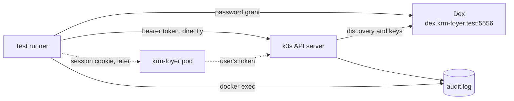

# How krm-foyer is tested

krm-foyer sits between browsers and a cluster, and its main promise is a negative one:
**it does not invent authentication or authorization.** Dex, or whichever issuer is
configured, says who the user is. The API server says what that user may do. krm-foyer
carries the user's credential and can only narrow access with its allowlist. This
document describes how the tests prove that, and in what order they get written.

## What has to be proved

| Claim | What would break it | How the suite catches it |
| --- | --- | --- |
| Identity comes from the issuer | krm-foyer asserting a user name, impersonating, or accepting a token issued to another client | The audit log names the user and shows no impersonation; tokens for other clients are rejected |
| Permission comes from RBAC | krm-foyer deciding something itself, or caching a decision | The same request gets the same answer through krm-foyer as it does directly; a RoleBinding change shows on the next request |
| No service-account fallback | A request without a usable user credential being sent with krm-foyer's own identity | The e2e deployment gives krm-foyer's service account cluster-admin, so a fallback turns a 403 into a 200 |
| The allowlist only narrows | A route being exposed without configuration, or a path trick getting past the check | An empty allowlist exposes nothing to a user RBAC allows everything; fuzzed paths never match more than intended |
| The credential stays on the server | A token or session ID in a response body, header, page or log line | Every response and log line is scanned for every token involved, including those krm-foyer obtained by refresh |

## Four techniques

**Differential answers.** The suite logs in to Dex as a user and keeps that user's own
token. For any request, it asks the API server directly with that token and then asks
krm-foyer with that user's session. Status code, `Status` body and content type must be
the same. If krm-foyer made any decision of its own, the two would differ. This one
technique covers most of "does not invent authorization", and it needs no list of
expected answers to maintain: the API server supplies the expected answer.

**The audit log as witness.** The fixture's API server writes an audit log. krm-foyer can
influence what it sends, but not what the API server writes down, so the log settles
whose credential a request used. Each request the suite makes carries a unique
User-Agent, which finds its audit event.

**A bait service account.** In the e2e deployment, krm-foyer's own service account is
cluster-admin. This makes the most dangerous bug the loudest one: a fallback would turn
a refusal into success.

**Token scan.** After the run, no response the suite received from krm-foyer, and no line
krm-foyer logged, may contain a token or a session ID. The tokens to look for are the
ones the suite obtained itself plus the ones krm-foyer holds, read from its session store
as admin. That second set includes tokens krm-foyer got by refreshing, which the suite
never saw.

## The layers

| Layer | Runs with | What it covers |
| --- | --- | --- |
| Unit | `task test` (`go test -race ./...`) | Allowlist matching, path checking, header handling, session and cookie rules, page rendering. Fast and exhaustive |
| e2e | `task test-e2e` | A real API server trusting a real Dex. Today it validates that fixture; once krm-foyer is deployed in front of it, the pending specs (differential answers, service-account fallback, token scan) prove the claims above |
| Browser | Not yet | Playwright, once the example frontend exists. Only for what a Go HTTP client cannot show |

Both layers run in `task verify` and in CI.

### Unit tests

These use the standard library `testing` package, with table tests. Most boundary
bugs are here, where they are cheap to find:

- **The allowlist matcher** is a pure function: a request (method, path, query) and a
  policy in, allow or deny out. The table covers every row of
  [access boundaries](design.md#access-boundaries): encoded slashes, `..` and repeated
  slashes (all rejected), alternate versions, subresources, `watch=true`, selectors, and
  `limit` with `continue`. Two fuzz properties: an empty policy allows nothing, and for any
  request that is allowed, the path sent upstream is byte-for-byte the path that was
  checked. That second property is the
  [one-parser rule](ingress.md#why-routing-by-path-is-safe-when-forward-auth-is-not)
  in test form.
- **The proxy** runs against an `httptest` server standing in for the API server,
  which records what reached it. That shows what e2e cannot see directly: the browser's
  `Authorization`, `Impersonate-*` and cookie headers never arrive, and the user's token
  always does.
- **Sessions**: rotation at login, idle and absolute expiry, CSRF, and logout.

### e2e tests

The suite lives in [test/e2e](../test/e2e) behind the `e2e` build tag. It uses Ginkgo
and Gomega, like gitops-reverser's suite. It has two parts:

- **The fixture's API server** (label `fixture`) involves no krm-foyer code. It shows that
  the fixture tells the truth: a Dex user is identified by their verified email, RBAC
  alone decides and follows grant changes, tokens for another client or with an altered
  payload are rejected, and the audit log names the user. If these fail, nothing else
  in the suite means anything.
- **krm-foyer** (label `foyer`) is the list of claims, written as pending specs. Each one
  becomes a real spec in the change that implements it. `task test-e2e -- -v -ginkgo.v`
  lists them.

## The e2e fixture



[start-cluster.sh](../test/e2e/cluster/start-cluster.sh) creates a Docker network,
starts Dex at a fixed address on it, and creates a single-node k3d cluster on the same
network. The API server trusts Dex through an
[AuthenticationConfiguration](../test/e2e/cluster/authentication-config.yaml) and
records requests with an [audit policy](../test/e2e/cluster/audit-policy.yaml). No port
is published. The devcontainer joins the network, and a CI runner is the Docker host,
so both reach it the same way.

Dex has two static users, `alice@example.com` and `bob@example.com` (password
`password`), which Kubernetes sees as `oidc:alice@example.com` and
`oidc:bob@example.com`. There are two clients: `krm-foyer`, whose tokens the cluster
accepts, and `other-app`, whose tokens it must reject.

```bash
task e2e-up     # start or reuse the fixture (about 25 seconds the first time)
task test-e2e   # run the suite; brings the fixture up if needed
task e2e-down   # remove the cluster, Dex, the network and the certificates
```

When something fails, the API server's view is usually the answer:
`docker logs k3d-krm-foyer-e2e-server-0` shows authenticator errors, and
`docker exec k3d-krm-foyer-e2e-server-0 cat /etc/krm-foyer-e2e/audit.log` shows who it
thought was asking. `KUBECONFIG=.e2e/kubeconfig kubectl ...` gives admin access for
looking around.

## Order of work

The [roadmap](roadmap.md#order-of-work) sets the order: the allowlist matcher, then the
proxy, then login and sessions deployed into the fixture, then streams. Each step makes
pending specs real.

To keep krm-foyer small, the OIDC work uses maintained libraries (`coreos/go-oidc` and
`golang.org/x/oauth2`), and the proxy uses `net/http/httputil`. Neither the service nor
its tests need `client-go`.
