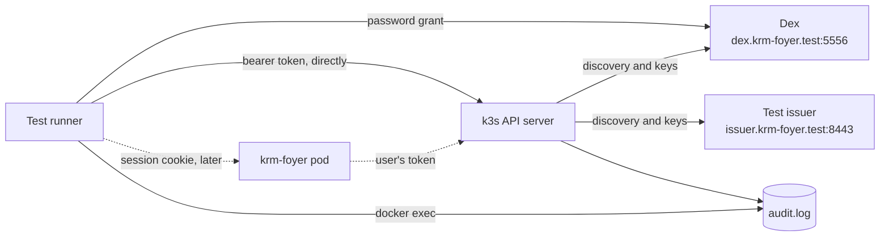

# How krm-foyer is tested

krm-foyer sits between browsers and a cluster, and its main promise is a negative one:
**it does not invent authentication or authorization.** Dex, or whichever issuer is
configured, says who the user is. The API server says what that user may do. krm-foyer
carries the user's credential and decides nothing about access. This document
describes how the tests prove that.

## What has to be proved

| Claim | What would break it | How the suite catches it |
| --- | --- | --- |
| Identity comes from the issuer | krm-foyer asserting a user name, impersonating, or accepting a token issued to another client | The audit log names the user and shows no impersonation; tokens for other clients are rejected |
| Permission comes from RBAC | krm-foyer deciding something itself, or caching a decision | The same request gets the same answer through krm-foyer as it does directly; a RoleBinding change shows on the next request |
| No service-account fallback | A request without a usable user credential being sent with krm-foyer's own identity | The e2e deployment gives krm-foyer's service account cluster-admin, so a fallback turns a 403 into a 200 |
| One parse of each path | A path krm-foyer reads one way and Kubernetes another | Non-canonical paths are rejected; fuzzing shows the path forwarded is byte-for-byte the path received |
| The credential stays on the server | A token or session ID in a response body, header, page or log line | Every response and log line is scanned for every token involved, including those krm-foyer obtained by refresh |

## Four techniques

**Differential answers.** The suite logs in to Dex as a user and keeps that user's own
token. For any request, it asks the API server directly with that token and then asks
krm-foyer with that user's session. Status code, `Status` body and content type must be
the same. If krm-foyer made any decision of its own, the two would differ. This one
technique covers most of "does not invent authorization", and it needs no list of
expected answers to maintain: the API server supplies the expected answer.

**The audit log as witness.** The fixture's API server writes an audit log. krm-foyer can
influence what it sends, but not what the API server writes down, so the log settles
whose credential a request used. Each request the suite makes carries a unique
User-Agent, which finds its audit event.

**A bait service account.** In the e2e deployment, krm-foyer's own service account is
cluster-admin. This makes the most dangerous bug the loudest one: a fallback would turn
a refusal into success.

**Token scan.** After the run, no response the suite received from krm-foyer, and no line
krm-foyer logged, may contain a token or a session ID. The tokens to look for are the
ones the suite obtained itself plus the ones krm-foyer holds, read from its session store
as admin. That second set includes tokens krm-foyer got by refreshing, which the suite
never saw.

A session ID has exactly one place it belongs: the `Set-Cookie` header that issues it,
on the login callback and wherever the ID is rotated. The scan allows the ID there, and
only as the value of krm-foyer's own session cookie. A session ID anywhere else in that
response, in any other response, or in a log line still fails the run.

## The layers

| Layer | Runs with | What it covers |
| --- | --- | --- |
| Unit | `task test` (`go test -race ./...`) | Path checking, header handling, upstream response rules, session and cookie rules, page rendering. Fast and exhaustive |
| e2e | `task test-e2e` | A real API server trusting a real Dex. Today it validates that fixture; once krm-foyer is deployed in front of it, the pending specs (differential answers, service-account fallback, token scan) prove the claims above |
| Browser | Not yet | Playwright, once the example frontend exists. Only for what a Go HTTP client cannot show |

Both layers run in `task verify` and in CI.

### Unit tests

These use the standard library `testing` package, with table tests. Most boundary
bugs are here, where they are cheap to find:

- **Path checking** ([internal/proxy](../internal/proxy)) is a pure function: a path in, the upstream path or a refusal out.
  The table covers [path hygiene](design.md#access): encoded slashes, `..`, repeated
  slashes and needless percent-encoding are all rejected. The fuzz property: for any path
  accepted, the path sent upstream is byte-for-byte the path received, minus `/k8s`.
  That is the
  [one-parser rule](ingress.md#why-routing-by-path-is-safe-when-forward-auth-is-not)
  in test form.
- **The proxy** runs against an `httptest` server standing in for the API server,
  which records what reached it. That shows what e2e cannot see directly: the browser's
  `Authorization`, `Impersonate-*` and cookie headers never arrive, and the user's token
  always does. Each test that matters runs over HTTP/1.1 and HTTP/2 to the API server.
- **The upstream response check** is fuzzed from the browser's side: whatever the
  upstream sends, an approved response has only allowlisted headers, no encoding, and a
  single content type that a browser cannot read as anything but an allowed one. The
  property is written independently of the check, so it can catch the check's own
  blind spots, such as a repeated `Content-Type` field.
- **Interruption pages**: every row of the interruptions table is triggered twice, as
  code and as a browser navigation, and must give the same status both times. A
  `fetch`, an iframe, another method, a capitalized or repeated `Sec-Fetch-Dest` and
  `Accept: text/html` alone all get JSON, and the API server's own 401, 403, 404, 409,
  422, 429, 500 and 503 reach a navigation unchanged.
- **Sessions** ([internal/session](../internal/session)): rotation at login (a planted
  ID is never adopted), idle, absolute and token expiry, logout winning over a request
  that is recording activity, and a store failure never read as "no session". Expiry
  runs against a store that never expires anything as well, so the session code decides
  on its own. Every way of presenting other than exactly one well-formed cookie is no
  session.
- **Login** ([internal/auth](../internal/auth)) runs against a fake issuer in the test
  that behaves like a strict one (PKCE enforced, codes single use) unless told to
  misbehave: a token for another audience or issuer, expired, signed by a stranger, with
  another nonce or none. A browser with a cookie jar walks each flow, including login
  CSRF (the attacker's callback in the victim's browser), replayed and malformed
  callbacks and an expired login. Every response that browser received is then scanned
  for ID tokens, the client secret and PKCE verifiers, and for session IDs outside the
  `Set-Cookie` that issues them. Dex is the e2e suite's issuer, for what a real login
  does; the fake issuer is for refusals Dex never causes.
- **Return paths** are fuzzed against a model of how a browser resolves a `Location`
  (the WHATWG URL standard's leniencies: backslashes, stripped tabs, any number of
  leading slashes), not against the check itself: whatever is accepted stays on the
  origin.
- **CSRF and same origin** are fuzzed with the rule stated from outside: a request is let
  through exactly when it is a `GET` or `HEAD`, or carries one proof field equal to the
  session's token and one `Origin` equal to the configured origin (or, with no `Origin`,
  one `Sec-Fetch-Site: same-origin`). Repeated fields, which `Header.Get` would read only
  the first of, are part of the input.

### e2e tests

The suite lives in [test/e2e](../test/e2e) behind the `e2e` build tag. It uses Ginkgo
and Gomega, like gitops-reverser's suite. It has two parts:

- **The fixture's API server** (label `fixture`) involves no krm-foyer code. It shows that
  the fixture tells the truth: a Dex user is identified by their email, and only when the
  issuer says that email is verified (`email_verified` absent, `false` or a string is
  refused); RBAC alone decides and follows grant changes; tokens for another client, or
  with claims rewritten after signing, are rejected; and the audit log names the user.
  Every refusal has a matching acceptance next to it, so a 401 cannot pass for the wrong
  reason. If these fail, nothing else in the suite means anything.
- **krm-foyer** (label `foyer`) is the list of claims, written as pending specs. Each one
  becomes a real spec in the change that implements it. `task test-e2e -- -v -ginkgo.v`
  lists them.

## The e2e fixture



[start-cluster.sh](../test/e2e/cluster/start-cluster.sh) creates a Docker network,
starts Dex and a test issuer at fixed addresses on it, and creates a single-node k3d
cluster on the same network. The API server trusts both issuers through an
[AuthenticationConfiguration](../test/e2e/cluster/authentication-config.yaml), under the
same rules, and records requests with an [audit policy](../test/e2e/cluster/audit-policy.yaml).
The devcontainer joins the network, and a CI runner is the Docker host, so both reach it
the same way. k3d always publishes the API server's port; it is bound to loopback, and
the script fails if anything in the fixture is published on another interface.

The test issuer is nginx serving a discovery document and a JWKS. The suite holds its
signing key (`.e2e/issuer-signing.key`), so it can mint tokens with claims Dex never
issues. Use it for claims; use Dex for anything a real login would do.

Dex has two static users, `alice@example.com` and `bob@example.com` (password
`password`), which Kubernetes sees as `oidc:alice@example.com` and
`oidc:bob@example.com`. There are two clients: `krm-foyer`, whose tokens the cluster
accepts, and `other-app`, whose tokens it must reject.

```bash
task e2e-up     # start or reuse the fixture (about 25 seconds the first time)
task test-e2e   # run the suite; brings the fixture up if needed
task e2e-down   # remove the cluster, Dex, the network and the certificates
```

When something fails, the API server's view is usually the answer:
`docker logs k3d-krm-foyer-e2e-server-0` shows authenticator errors, and
`docker exec k3d-krm-foyer-e2e-server-0 cat /etc/krm-foyer-e2e/audit.log` shows who it
thought was asking. `KUBECONFIG=.e2e/kubeconfig kubectl ...` gives admin access for
looking around.

## Order of work

The [roadmap](roadmap.md#order-of-work) sets the order: the proxy, then login and
sessions deployed into the fixture, then streams. Each step makes
pending specs real.

To keep krm-foyer small, the OIDC work uses maintained libraries (`coreos/go-oidc` and
`golang.org/x/oauth2`), and the proxy uses `net/http/httputil`. Neither the service nor
its tests need `client-go`.
