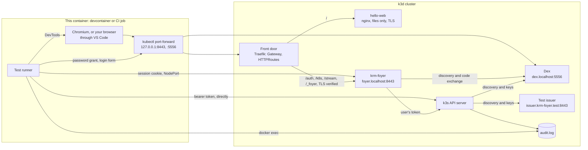

# How krm-foyer is tested

krm-foyer sits between browsers and a cluster, and its main promise is a negative one:
**it does not invent authentication or authorization.** Dex, or whichever issuer is
configured, says who the user is. The API server says what that user may do. krm-foyer
carries the user's credential for API calls and per-user watches. Shared watches
use an explicit service identity, with API-server reviews for every subscriber. This document
describes how the tests prove that.

## What has to be proved

| Claim | What would break it | How the suite catches it |
| --- | --- | --- |
| Identity comes from the issuer | krm-foyer asserting a user name, impersonating, or accepting a token issued to another client | The audit log names the user and shows no impersonation; tokens for other clients are rejected |
| Permission comes from Kubernetes | krm-foyer granting access itself or reusing a decision beyond its subject, scope or lifetime | Proxied requests match direct answers and see RoleBinding changes on the next request; shared streams test exact decision keys and bounded rechecks |
| No service-account fallback | A request without a usable user credential being sent with krm-foyer's own identity | The e2e deployment gives krm-foyer's service account cluster-admin, so a fallback turns a 403 into a 200 |
| One parse of each path | A path krm-foyer reads one way and Kubernetes another | Non-canonical paths are rejected; fuzzing shows the path forwarded is byte-for-byte the path received |
| The credential stays on the server | A token or session ID in a response body, header, page or log line | Every response and log line is scanned for every token involved, with refreshed credentials to be added when refresh exists |

## Four techniques

**Differential answers.** The suite logs in to Dex as a user and keeps that user's own
token. For any request, it asks the API server directly with that token and then asks
krm-foyer with that user's session. Status code, content type and body must be the same,
for successes as much as for refusals: transparent answers are the promise, and an empty
or altered object would break it as surely as a wrong status. Only what the API server
generates afresh for each request is set aside, and named: a list's `resourceVersion`,
and on a write the new object's `uid`, `creationTimestamp`, `resourceVersion`,
`managedFields` times and generated name. If krm-foyer made any decision of its own, or
changed what it passed on, the two would differ. This one technique covers most of "does
not invent authorization", and it needs no list of expected answers to maintain: the API
server supplies the expected answer.

**The audit log as witness.** The fixture's API server writes an audit log. krm-foyer can
influence what it sends, but not what the API server writes down, so the log settles
whose credential a request used. Each request the suite makes carries a unique
User-Agent, which finds its audit event.

**A bait service account.** In the e2e deployment, krm-foyer's own service account is
cluster-admin. This makes the most dangerous bug the loudest one: a fallback would turn
a refusal into success.

**Token scan.** No response the suite received from krm-foyer, and no line krm-foyer
logged, may contain a token, a client secret or a session ID. The scan runs as a spec and
again after the whole suite. It looks for every token the suite obtained, exactly, and for
anything shaped like a JWT. The second covers the tokens krm-foyer holds and never showed
the suite: the ID tokens it got by redeeming codes, and its own service-account token.
krm-foyer holds no refresh token yet, since it asks for no `offline_access`. When refresh
arrives, the scan must also inspect stored credentials for opaque refresh tokens no
pattern can find. The session cookie holds the ID token sealed, so it is scanned as well,
as set and as decoded: no Set-Cookie is exempt.

A session ID has exactly one place it belongs: the `Set-Cookie` header that issues it,
on the login callback and wherever the ID is rotated. The scan allows the ID there, and
only as the value of krm-foyer's own session cookie. A session ID anywhere else in that
response, in any other response, or in a log line still fails the run.

## The layers

| Layer | Runs with | What it covers |
| --- | --- | --- |
| Unit | `task test` (`go test -race ./...`) | Path checking, header handling, upstream response rules, session and cookie rules, page rendering. Fast and exhaustive |
| e2e | `task test-e2e` | A real API server trusting a real Dex, and krm-foyer deployed in the cluster in front of it. The fixture's own specs validate the fixture; the `foyer` specs prove the claims above |
| Browser | `task test-e2e` (label `browser`) | The [hello example](../examples/hello) in Chromium, through the front door: Dex's own login form, a 409, a 403, logout, and no credential within the page's reach. Only for what a Go HTTP client cannot show |

All three run in `task verify` and in CI.

### Unit tests

These use the standard library `testing` package, with table tests. Most boundary
bugs are here, where they are cheap to find:

- **Path checking** ([internal/proxy](../internal/proxy)) is a pure function: a path in, the upstream path or a refusal out.
  The table covers [path hygiene](design.md#access): encoded slashes, `..`, repeated
  slashes and needless percent-encoding are all rejected. The fuzz property: for any path
  accepted, the path sent upstream is byte-for-byte the path received, minus `/k8s`.
  That is the
  [one-parser rule](ingress.md#why-routing-by-path-is-safe-when-forward-auth-is-not)
  in test form.
- **The proxy** runs against an `httptest` server standing in for the API server,
  which records what reached it. That shows what e2e cannot see directly: the browser's
  `Authorization`, `Impersonate-*` and cookie headers never arrive, and the user's token
  always does. Each test that matters runs over HTTP/1.1 and HTTP/2 to the API server.
- **The upstream response check** is fuzzed from the browser's side: whatever the
  upstream sends, an approved response has only allowlisted headers, no encoding, and a
  single content type that a browser cannot read as anything but an allowed one. The
  property is written independently of the check, so it can catch the check's own
  blind spots, such as a repeated `Content-Type` field.
- **Interruption pages**: table-driven tests exercise proxy interruptions as
  code and as browser navigations, checking that the status is the same. Rate,
  concurrency, size and stream-method refusals also have tests in their own suites;
  the roadmap retains a full contract-to-test audit as unfinished work. A
  `fetch`, an iframe, another method, a capitalized or repeated `Sec-Fetch-Dest` and
  `Accept: text/html` alone all get JSON, and the API server's own 401, 403, 404, 409,
  422, 429, 500 and 503 reach a navigation unchanged.
- **Sessions** ([internal/session](../internal/session)): a new session at every login (a
  planted cookie is never adopted), absolute and token expiry decided by krm-foyer's
  clock, before and after a restart, and a lower timeout applying to cookies already
  issued. Every bit of a cookie is flipped, and each is no session; so is every way of
  presenting other than exactly one cookie that opens: another version, key, name or
  spelling, a short or a long one, and a payload sealed with the right key that is not a
  whole session. A restart with the same keys keeps the session, its CSRF token and its
  end; rotation keeps it during the overlap and ends it when its key goes. Logout and a
  new login end the open responses of that session, and of no other, while a copy of
  the cookie stays a session: the tests record that limit rather than hide it. A session
  too large for its cookie is refused before a cookie is set.
- **Login parameters and identity** ([internal/auth](../internal/auth),
  [internal/stream](../internal/stream)): the same code forwards two issuers'
  differently named parameters, defaults and values with spaces, `&`, `=`, `%` and
  non-ASCII intact; every way past the configuration, krm-foyer's own parameters among
  them, is the same 400 before any login starts, with the value neither shown nor logged;
  a retry link repeats a listed choice and never a free hint. Session claims come from
  the verified token in a fixed shape, and a requested connector never becomes the
  session's. `/auth/whoami` sends one SelfSubjectReview with the user's token alone,
  passes the API server's refusals on, fails closed on errors, empty answers and
  redirects, and never forwards a browser's identity headers. End to end, Dex receives a
  link's approved options, and the attribution extras appear in `/auth/whoami`, the audit
  event and the admission request of an accepted write, whatever the browser claims.
- **Open responses end with their session** ([internal/proxy](../internal/proxy)), over
  every pair of HTTP/1.1 and HTTP/2 towards the browser and towards the API server: when
  the session ends, the browser's response is aborted, never ended cleanly, and the
  request to the API server is cancelled. So is a response whose session ends before
  the API server answers, one whose session check hangs, and one whose browser has
  stopped reading; a live session's response is never touched. The same holds for a
  response open longer than its duration.
- **Concurrency bounds** ([internal/proxy](../internal/proxy)): a request past a
  session's or the replica's limit gets a 429 naming the bound and never reaches the
  API server, and every way a request can end (complete, the browser leaving, the
  session ending, its duration up, an answer held back, a dropped connection) gives its
  slot back.
- **The request rate** ([internal/proxy](../internal/proxy)), against a clock the test
  moves: past a session's burst, a 429 with `Retry-After` (the wait rounded up to whole
  seconds, in both forms) that never reaches the API server. Its property
  ([internal/gate](../internal/gate)) is stated from outside the bucket and checked over
  random request times: in any stretch of time a
  session gets at most its burst plus the rate times the stretch let through, and a
  session that never sends faster than the rate is never refused.
- **The response-byte bound** ([internal/proxy](../internal/proxy)) counts decoded bytes,
  exactly: *L* − 1 and *L* bytes pass whole, *L* + 1 gets a 502 when its length is
  known and is cut short after exactly *L* bytes when it is gzip-encoded, over HTTP/1.1
  and HTTP/2. A gzip stream of zeros that would expand without end is stopped at the
  bound and cancelled at the API server. The property is checked from the browser's
  side over random sizes, chunkings and encodings: a response that ends cleanly is
  complete and within the bound, and none ever delivers more.
- **Streams** ([internal/stream](../internal/stream)) run krm-stream's gateway against an
  `httptest` API server that answers a streaming list. A stream opens its watch with
  its own session's token and nothing the browser sent but its `User-Agent`, twenty
  streams of two sessions open at once included; without a session it is krm-foyer's
  401 and reaches nothing; a method other than `GET` is krm-foyer's 405. The upstream is
  pinned and verified. Scopes the gateway will not serve (an API-server address, a
  token, another target, a malformed name) end with a terminal refusal before anything
  is sent. Kubernetes' 403, 401 and 404 keep their meaning, with no address inside the
  cluster in what the browser reads. A stream whose session ends is aborted and its watch
  cancelled, even where no write deadline can be set. A redirect from the API server is
  not followed, to another https server or to plain http, so the token goes nowhere
  else. A 401 or 403 on an open watch ends the stream as it does at opening. A failure
  that may pass (a 503 or 429 at opening, a 500 or 429 on an open watch) ends the stream
  with a non-terminal `UPSTREAM_UNAVAILABLE` and the API server's hint, after one
  attempt in these fixtures: they put the hint in the `Status`, not a `Retry-After`
  header that client-go would retry internally. The browser's client retries through
  the gate. A watch that ends before its
  snapshot or hardly after it, or with a 410 right after it, is opened once more and
  then ends the stream the same way, after two attempts and never more. What the API server wrote when it failed,
  the token it echoed among it, reaches neither the browser nor the log, and an ended
  stream leaves no goroutine behind while the API server is still sending. Streams count against limits of
  their own, not the request limits, but draw on the same request rate; the streams
  open and the watches they hold at the API server are counted, and counted out again
  when a stream ends. A watch the API server ends, or ends with 410 Gone, is opened
  again on the same stream, as the user, with a fresh snapshot of what changed in
  between, and without the wait or the warning of a failure. Each was seen to fail against a
  build broken on purpose.
- **Shared watches** ([internal/stream](../internal/stream/shared_test.go)), against an
  `httptest` API server that also answers SelfSubjectReviews and SubjectAccessReviews.
  Six streams of two users on one scope are one watch, opened with the shared token, two
  reviews per user rather than per stream, and one change reaches all six; the last
  stream out closes the watch. A user RBAC refuses gets a terminal `FORBIDDEN` and none
  of the notes, though another user's stream holds the watch open, and the reviews ask
  about that user as the API server resolved them: username, UID, groups and extras. A
  grant taken away ends that user's stream at the next recheck, and the other stream
  carries on with the next change. A user's token goes with their SelfSubjectReview and
  their own watches alone, the shared token with the reviews and the shared watch alone,
  and the shared identity's name reaches no browser and no log. A token the API server
  does not take, reviews failing or answered without a decision, and the shared identity
  refused each end the stream without serving it. A session ending closes its own
  streams and leaves the watch to the others. A browser that stops reading, with the
  buffers between full, cannot hold off the recheck of a revoked grant: the write
  timeout ends its stream within the bound. A shared watch stuck opening, before even
  its headers, holds up no other scope, and is cancelled at the API server once the
  stream that asked for it leaves, freeing its slot. Both failed before their fixes,
  as a review found them. Seven builds broken on purpose (every
  subscriber allowed, no sharing, no timed recheck, a decision key without groups,
  errors kept, the shared identity's refusal passed on, no reuse at all) each failed.
  `FuzzDecisionsAreTransparent` checks, from the outside, that reusing decisions never
  changes an answer: sequences of questions that differ in one field of the subject or
  the scope, against an oracle that knows nothing of the cache. Keys missing the UID,
  the extras, the name, the version or the group each failed it within a second; the
  label selector is left out on purpose, as the reviews do not ask about it, and a test
  fails if they start to. A rate-budget regression spends the shared identity's burst
  on two reviews and checks that opening its watch waits for the same budget to refill;
  client-go's built-in limiter alone does not throttle watch openings.
- **Upstream text in the log** ([internal/proxy](../internal/proxy),
  [internal/upstream](../internal/upstream)): an API server that echoes the token in a
  malformed response, a `Content-Type` or a `Location` never gets it into krm-foyer's
  log, which names failures by kind from a fixed set.
- **Login** ([internal/auth](../internal/auth)) runs against a fake issuer in the test
  that behaves like a strict one (PKCE enforced, codes single use) unless told to
  misbehave: a token for another audience or issuer, expired, signed by a stranger, with
  another nonce or none. A browser with a cookie jar walks each flow, including login
  CSRF (the attacker's callback in the victim's browser), replayed and malformed
  callbacks and an expired login. Every response that browser received, and every line
  krm-foyer logged, is then scanned for ID and access tokens, the client secret,
  authorization codes and PKCE verifiers, and for session IDs outside the `Set-Cookie`
  that issues them. The fake issuer can also refuse a token request by echoing it, in
  each place an OAuth error has room for text, so the scan proves those refusals are
  logged by status and error code only. The proxy runs behind login as the binary wires it, so a
  refused request is shown never to reach the API server, and each session error,
  however wrapped, becomes one answer that is never RBAC's `Forbidden`. Dex is the e2e suite's issuer, for what a real login
  does; the fake issuer is for refusals Dex never causes.
- **Return paths** are fuzzed against a model of how a browser resolves a `Location`
  (the WHATWG URL standard's leniencies: backslashes, stripped tabs, any number of
  leading slashes), not against the check itself: whatever is accepted stays on the
  origin.
- **CSRF and same origin** are fuzzed with the rule stated from outside: a request is let
  through exactly when it is a `GET` or `HEAD`, or carries one proof field equal to the
  session's token and one `Origin` equal to the configured origin (or, with no `Origin`,
  one `Sec-Fetch-Site: same-origin`). Repeated fields, which `Header.Get` would read only
  the first of, are part of the input.

### e2e tests

The suite lives in [test/e2e](../test/e2e) behind the `e2e` build tag. It uses Ginkgo
and Gomega, like gitops-reverser's suite. It has two parts:

- **The fixture's API server** (label `fixture`) involves no krm-foyer code. It shows that
  the fixture tells the truth: a Dex user is identified by their email, and only when the
  issuer says that email is verified (`email_verified` absent, `false` or a string is
  refused); RBAC alone decides and follows grant changes; tokens for another client, or
  with claims rewritten after signing, are rejected; and the audit log names the user.
  Every refusal has a matching acceptance next to it, so a 401 cannot pass for the wrong
  reason. If these fail, nothing else in the suite means anything.
- **krm-foyer** (label `foyer`) is the list of claims. The suite signs in the way a
  person does: a cookie jar opens `/auth/login`, walks Dex's login form and comes back
  through the callback. Claims not built yet are pending specs, each made real in the
  change that implements it; `task test-e2e -- -v -ginkgo.v` lists them.
- **Mutation checks against the cluster.** A boundary spec is trusted once a build of
  krm-foyer that breaks the boundary on purpose, deployed into the fixture, makes it
  fail: a service-account fallback, a forwarded `Authorization` or `Impersonate-User`,
  the service account's token sent instead of the user's, an unchecked `state`. The
  impersonation spec first passed for the wrong reason (alice could not impersonate
  anyone, so a forwarded header was refused anyway); it now grants alice the right to
  impersonate bob, so a forwarded header would turn its 403 into a 200.
- **Bounds and the session lifecycle** (in the `foyer` label) read krm-foyer's metrics
  through the API server's service proxy, as admin. A native watch through `/k8s` is
  aborted when its session logs out and when it expires, and the audit log shows the API
  server completed it within a minute although it asked for `timeoutSeconds=600`: the
  cancellation reached the API server. The same is shown for a watch open longer than
  its duration. Each was seen to fail against a build that did not cut the response. A
  session's third request while two watches are open gets krm-foyer's own 429 and never
  reaches the API server, which a build without the per-session check failed. So does a
  session sending faster than its rate, with `Retry-After`, which a build whose rate
  never refuses failed. A list the API server compresses to a few hundred bytes, but
  that decodes to 200 KiB, never passes the brief instance's 128 KiB bound as a complete
  answer, which a build without the byte bound failed.
- **Streams** (in the `foyer` label), of ConfigMaps, which are not shared: bob streams
  the ConfigMaps RBAC lets him read, gets the
  snapshot and then a change made while he watches, and the audit log names bob, and
  nobody else, for every request of that stream. alice, with no grant, gets a terminal
  `FORBIDDEN` with Kubernetes' own message, and the audit log shows the API server
  refused alice herself. Without a session there is a 401 and no request at all. A
  build that opened watches with its service account, cluster-admin in the fixture,
  failed the first two. A stream open when its session logs out, or expires on the brief
  instance, is aborted within the session-check interval, and the audit log shows the
  API server completed its watch within a minute, though the gateway names no
  `timeoutSeconds`; opened again, it gets the 401. A build whose gateway ran on a
  context the gate could not cancel failed both. On the brief instance, a session with
  two streams open, its limit, may still open two native watches, and its third stream
  is krm-foyer's 429 and never reaches the API server; the build before stream limits
  failed it.
- **Shared watches** (in the `foyer` label; notes are shared in the fixture, with an
  identity of their own beside the cluster-admin bait): three streams each for alice
  and bob are one watch at the API server, six subscriptions, every user resolved once a
  stream and asked about less often, and one change reaches all six; the audit log shows
  every request on the namespace's notes made by the shared identity, never the bait or
  a user, and exactly one watch. Bob, without a grant, gets `FORBIDDEN` and none of the
  notes alice's stream holds open, and his token went with his SelfSubjectReview alone.
  Bob logging out ends his stream and leaves the watch to alice. On the brief instance,
  which rechecks every 2 seconds, taking bob's grant away ends his stream within 10
  seconds while alice's carries on.
- **The rehearsal** (labels `foyer` and `rehearsal`) holds 1800 streams of 200 signed-in
  identities on one replica, twice: streams of ConfigMaps, each a watch of its user's
  own, and streams of shared notes, one watch for all of them. It fails unless one
  change reaches all of them, every stream is aborted within the session-check interval
  of its logout, and streams, watches at the API server and goroutines all return to
  where they were; the shared run also holds every stream past a recheck interval and
  counts the access checks. What it
  measured is in [bounds](bounds.md#measured-the-rehearsal). Dex has its 200 users from
  `start-cluster.sh`, which `task demo` uses too.
- **The hello example** (label `browser`) is the claim that krm-foyer is usable, not
  only correct. Chromium ([chromedp/headless-shell](https://hub.docker.com/r/chromedp/headless-shell),
  pinned by digest, driven from Go with chromedp) runs in the network namespace of the
  container the suite runs in, so `*.localhost` reaches the same port-forwards a
  person's browser reaches through VS Code. It trusts
  exactly the front door's and Dex's certificates, by their public keys. The example
  follows its notes through `/stream`: a change made with `kubectl` appears in the page
  without a reload; one made to a note alice is typing in is shown as a conflict, with
  her text kept; and a change the stream does not show (the last-applied-configuration
  annotation, which every projection removes) gets a 409 on save, after which the page
  catches up and saves only when asked again. When the connection drops (the spec kills
  the front door's port-forward, so every connection through it breaks, and the session
  lives on), the page shows it is reconnecting; once the way is back it has a change
  made meanwhile, and alice's unsaved text is still hers. Signing out in another tab
  ends the live view with the page saying so. Its specs were each seen to fail against a broken build:
  the browser not trusting Dex, the example not reconnecting after a dropped connection,
  the example saving again on its own after a 409 or
  saving without its `resourceVersion`, a change from elsewhere replacing what alice
  typed, the page ignoring the end of its stream, the helper leaving out the CSRF header,
  and the helper not reading a new CSRF token after the user signed in again in another
  tab.

## The e2e fixture



Everything runs in the cluster, as in gitops-reverser's e2e; what a browser needs comes
out through `kubectl port-forward`.

[start-cluster.sh](../test/e2e/cluster/start-cluster.sh) creates a Docker network and a
single-node k3d cluster on it, then deploys the two issuers into the cluster
([issuers.yaml](../test/e2e/cluster/issuers.yaml)). The API server trusts both through an
[AuthenticationConfiguration](../test/e2e/cluster/authentication-config.yaml), under the
same rules, and records requests with an [audit policy](../test/e2e/cluster/audit-policy.yaml).
The API server is not a pod and cannot use cluster DNS: k3d's `--host-alias` puts each
issuer's name in the node's `/etc/hosts`, pointing at its Service's fixed ClusterIP, and
in CoreDNS for pods, so every caller uses the same issuer URL. Dex keeps its state in
custom resources, its signing keys included: with memory storage, a restarted Dex signs
with new keys, and the API server refused every token for 221 seconds before it fetched
them. The devcontainer joins the network, and a CI runner is the Docker host, so both reach
the API server the same way. k3d always publishes the API server's port; it is bound to
loopback, and the script fails if anything is published on another interface.

[deploy-foyer.sh](../test/e2e/cluster/deploy-foyer.sh) installs krm-foyer with the
[Helm chart](../charts/krm-foyer) and [foyer-values.yaml](../test/e2e/cluster/foyer-values.yaml),
so every spec also tests the chart a user installs. The image `task image` built is
imported with `k3d image import` under a tag derived from its ID, so the Deployment rolls
exactly when the binary changes. krm-foyer serves TLS for `foyer.localhost` with a
certificate from the fixture CA, trusts Dex through the same CA, and reaches the API
server at `kubernetes.default.svc`. The suite reaches it through a NodePort on the node's
address on the Docker network: the `foyer` specs test krm-foyer, not the front door. Its
service account is cluster-admin ([foyer-bait.yaml](../test/e2e/cluster/foyer-bait.yaml),
kept out of the chart) and its token is mounted, as bait; the suite checks both before it
starts.

Beside it runs a second, brief krm-foyer, a second release of the chart with
[foyer-brief-values.yaml](../test/e2e/cluster/foyer-brief-values.yaml) on top: the same image, certificate, public URL and Dex client, but sessions that end 45
seconds after login, a session check every second, responses cut short after 20
seconds, and per session two requests in flight and ten at once, then one a second. The specs that wait for a session to expire or a bound to be reached use it, on
a NodePort of its own, so no other spec has to race its session.

The front door is Gateway API, implemented by Traefik: the official chart, at the version
gitops-reverser's e2e uses. k3s's own Traefik is disabled, so k3s stays minimal, and
[install-traefik.sh](../test/e2e/cluster/install-traefik.sh) installs Traefik with Helm
and [traefik-values.yaml](../test/e2e/cluster/traefik-values.yaml) (`task e2e-up` runs
it). The chart brings the Gateway API CRDs.

[front-door.sh](../test/e2e/cluster/front-door.sh) applies the hello example's
[resources](../examples/hello/manifests.yaml), deploys a file server for its pages
([hello-web.yaml](../test/e2e/cluster/hello-web.yaml): nginx, files only, over TLS), and
applies [gateway.yaml](../test/e2e/cluster/gateway.yaml): a Gateway for `foyer.localhost`,
an `HTTPRoute` sending `/` to the file server without the `Cookie` header, one sending
`/auth`, `/k8s`, `/stream` and `/_foyer` to krm-foyer, and a `BackendTLSPolicy` for each
backend under which Traefik verifies its certificate (with a wrong hostname in it, every
request fails). The file server answers 400 to any request that still carries a cookie,
so every signed-in browser spec fails if the route stops removing it. It also applies
[traefik-routes.yaml](../test/e2e/cluster/traefik-routes.yaml), the Traefik recipe of
[the check](ingress.md#the-check): an `IngressRoute` on the same host with ForwardAuth
middlewares to `/auth/check`, which Traefik reaches at krm-foyer's Service name (its
certificate holds both names). `/public/whoami` stands in for a domain backend and
echoes the `Krm-Foyer-Identity` it received, and `/members/` is a page behind the login
gate. Specs reach them with `fx.frontDoorBrowser()`, through Traefik. Then
[port-forward.sh](../test/e2e/cluster/port-forward.sh) forwards Traefik to
`127.0.0.1:8443` and Dex to `127.0.0.1:5556` in this container, detached, and checks both
by their public names. Browsers resolve `foyer.localhost` and `dex.localhost` to loopback,
and VS Code forwards both ports to the machine the browser runs on, keeping their numbers
(`devcontainer.json`), so `https://foyer.localhost:8443` works with no hosts-file entry,
wherever Docker runs. A port-forward follows one pod: when Dex or Traefik rolls,
run `test/e2e/cluster/port-forward.sh` (or `task e2e-deploy`) again.

The test issuer is nginx serving a discovery document and a JWKS. The suite holds its
signing key (`.e2e/issuer-signing.key`), so it can mint tokens with claims Dex never
issues. Use it for claims; use Dex for anything a real login would do.

Dex has two demo users, `alice@example.com` and `bob@example.com` (password
`password`), which Kubernetes sees as `oidc:alice@example.com` and
`oidc:bob@example.com`, plus 200 generated rehearsal users. There are three clients:
`krm-foyer`, whose tokens the cluster accepts; `kubectl`, the operator's command line,
whose tokens it accepts under another name, `kubectl:alice@example.com`, as a
[browser identity](application-scope.md#a-browser-identity-in-kubernetes) needs; and
`other-app`, whose tokens it must reject.

```bash
task e2e-up     # start or reuse the fixture, with Traefik (about a minute the first time)
task e2e-deploy # build the image, deploy krm-foyer and the front door, and port-forward
task demo       # e2e-up and e2e-deploy, then how to sign in from your browser
task test-e2e   # run the suite; brings the fixture up and deploys krm-foyer first
task e2e-down   # remove the cluster, Dex, the network and the certificates
```

When something fails, the API server's view is usually the answer:
`docker logs k3d-krm-foyer-e2e-server-0` shows authenticator errors, and
`docker exec k3d-krm-foyer-e2e-server-0 cat /etc/krm-foyer-e2e/audit.log` shows who it
thought was asking. `KUBECONFIG=.e2e/kubeconfig kubectl ...` gives admin access for
looking around.

## What remains to prove

The [roadmap](roadmap.md#order-of-work) sets the next priorities. Pending e2e specs
currently cover refused refresh and targeted ingress/login-gate behavior. They are
listed by Ginkgo but do not fail the suite. Existing browser specs already exercise
Traefik routing, verified backend TLS and live notes; a passing run does not mean the
pending behaviors are implemented.

OIDC uses `coreos/go-oidc` and `golang.org/x/oauth2`; `/k8s` uses `net/http/httputil`.
Streams and Kubernetes subject/access reviews use `client-go`, directly and through
krm-stream. The Go modules and the vendored browser bundle are checked separately by
`task tidy-check` and `task vendor-check`, both included in `task verify` and CI.
